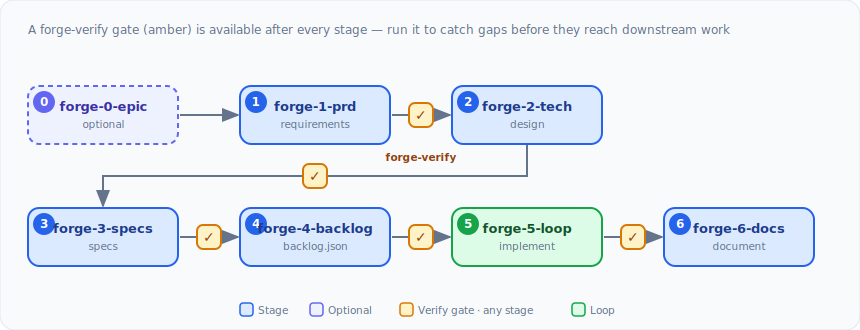

# feature-forge

A feature development pipeline that starts from true _requirements_ (deliberately abstracted from tech or implementation details) and enforces a structured flow, producing a complete implementation backlog an agent can process in an autonomous loop.

Works with any coding agent (Claude, Codex, Copilot, Cursor, or Gemini).

## How it works

feature-forge works like a compiler. You start with a vague idea, the agent helps you refine it through interaction, and each stage narrows it down and adds structure, until the output is a backlog of self-contained work items an agent can implement without any further context. Each loop iteration runs with a clean agent context (against artifacts that contain required context) to maximize results and minimize token consumption.

The stages are kept separate on purpose, so each one does a single job and isn't burdened with unnecessary context:

- **Requirements before design.** Stage 1 captures _what_ the feature must do, never _how_, and assigns stable `REQ-XXX-NN` identifiers. Those IDs become a traceability spine: every downstream artifact references the requirement it satisfies, and a coverage pass proves nothing was dropped.
- **Verification gates between stages.** A verification pass runs between stages to catch gaps and contradictions before they reach downstream stages, where they cost far more to fix.
- **Context hygiene through isolated subagents.** Codebase research, spec authoring, and artifact verification run in separate, mostly read-only subagent contexts, so the main session stays focused and fast.
- **State that persists across sessions.** Each feature's progress, versions, and commit hashes live in a state file, so you can stop, clear context, and pick up where you left off. If you revise an upstream artifact, staleness detection flags the downstream stages that depend on it.
- **Stack-aware output.** Built-in profiles for TypeScript, Python, Go, and Rust (with a generic fallback) tailor spec conventions, checks, and acceptance criteria to your project's toolchain.
- **An executable backlog, not just documents.** The final artifact is a validated `backlog.json` of granular work items. A swappable autonomous loop runner implements them, spawning a fresh agent session per item and committing atomically.

It is tuned for Claude but stays agent-agnostic, and runs on any of the supported coding agents.

### The pipeline at a glance

<picture>
  <source media="(prefers-color-scheme: dark)" srcset="docs/images/pipeline-dark.svg" />
  
</picture>

| Stage           | Skill             | Why it exists                                                                                                                                                  |
| --------------- | ----------------- | -------------------------------------------------------------------------------------------------------------------------------------------------------------- |
| 0 _(optional)_  | `forge-0-epic`    | Decompose a large change into related member features with declared dependencies and contracts (see [Epics](#epics-optional))                                  |
| 1               | `forge-1-prd`     | Pin down _what_ the feature must do, with stable requirement IDs, before any design decision is made                                                           |
| 2               | `forge-2-tech`    | Decide _how_ to build it, grounding every choice in a specific requirement and in real codebase patterns                                                       |
| 3               | `forge-3-specs`   | Turn decisions into implementation-ready specs (types, signatures, contracts) the loop can build against                                                       |
| 4               | `forge-4-backlog` | Compile the specs into a validated backlog of self-contained, criteria-driven work items                                                                       |
| 5               | `forge-5-loop`    | Implement the backlog autonomously, a fresh agent session per item, committed atomically                                                                       |
| 6               | `forge-6-docs`    | Document the architecture from the _actual_ implementation, for onboarding and maintenance                                                                     |
| ⟳ _(any stage)_ | `forge-verify`    | Catch gaps and contradictions before they reach later stages — **available after any stage** (PRD, tech spec, specs, backlog, or implementation), not just one |

Run `/feature-forge:forge <feature>` at any point to see what's complete, what's next, and what needs attention.

### Epics (optional)

Some changes are too large to be a single feature. An **epic** (`forge-0-epic`) splits such a change into discrete **member features** under one named subtree, recording the dependency edges and the `exposes`/`consumes` contracts between them on disk instead of in your head. Each member then runs the normal Stage 1 through 6 pipeline, with the epic's narrative and its direct dependencies' contracts injected automatically as context. Epic support is purely additive: when no epic is involved, every single-feature flow is byte-for-byte unchanged. See [docs/architecture/epic-orchestration/README.md](docs/architecture/epic-orchestration/README.md).

### The loop runner (rauf)

Stage 5 hands the backlog to an **autonomous loop runner** that spawns a fresh agent session per item, which keeps context from bleeding between tasks, and commits atomically as each item passes its acceptance criteria. The bundled default is [rauf](https://github.com/garygentry/rauf), but it is swappable. feature-forge binds to a runner only through the `loopRunner` block in `forge.config.json` (a backlog schema, a `validate` verb, and a signal protocol), so you can drop in a different runner without touching any pipeline skill. See [`references/ralph-loop-contract.md`](references/ralph-loop-contract.md) for the contract.

## Install

### (a) Claude Code (preferred) — marketplace

```bash
# Register the marketplace (one-time)
/plugin marketplace add garygentry/feature-forge

# Install the plugin
/plugin install feature-forge@feature-forge
```

> **Moved repo:** feature-forge previously shipped from the
> `garygentry/agent-plugins` marketplace as `feature-forge@gwg-plugins`. It now
> lives in its own repository. The old entry remains as a deprecated stub for
> one release cycle; please re-add the marketplace above to keep receiving
> updates.

### (b) Any agent — one-liner

Installs the canonical skills into every coding agent detected on your machine:

```bash
npx @garygentry/feature-forge install
```

Scope to one agent with `-a`, or preview without writing using `--dry-run --json`:

```bash
npx @garygentry/feature-forge install -a codex        # one agent
npx @garygentry/feature-forge install --dry-run --json # preview the plan, change nothing
```

### (c) Per-surface setup

| Agent   | Install                                                                                                | Setup doc                                        |
| ------- | ------------------------------------------------------------------------------------------------------ | ------------------------------------------------ |
| Claude  | `/plugin install feature-forge@feature-forge` _(or `npx @garygentry/feature-forge install -a claude`)_ | [docs/agents/claude.md](docs/agents/claude.md)   |
| Codex   | `npx @garygentry/feature-forge install -a codex`                                                       | [docs/agents/codex.md](docs/agents/codex.md)     |
| Copilot | `npx @garygentry/feature-forge install -a copilot`                                                     | [docs/agents/copilot.md](docs/agents/copilot.md) |
| Cursor  | `npx @garygentry/feature-forge install -a cursor`                                                      | [docs/agents/cursor.md](docs/agents/cursor.md)   |
| Gemini  | `npx @garygentry/feature-forge install -a gemini`                                                      | [docs/agents/gemini.md](docs/agents/gemini.md)   |

> The default loop runner ([forge-5-loop](#stage-5-loop-forge-5-loop)) is **rauf**. Provisioning it
> via `npx rauf@…` will be available once rauf is published to npm
> ([garygentry/rauf#28](https://github.com/garygentry/rauf/issues/28)); today, install rauf via its
> binary script (`curl -fsSL https://raw.githubusercontent.com/garygentry/rauf/main/scripts/install-binary.sh | bash`).
> See [docs/agents/claude.md#the-default-loop-runner](docs/agents/claude.md#the-default-loop-runner) for
> the full default loop path and agent-selection precedence.

## Quick Start

```
1. /feature-forge:forge-init                        # Create forge.config.json
2. /feature-forge:forge-1-prd user-authentication    # Start with requirements
3. /feature-forge:forge user-authentication          # Check status anytime
```

The pipeline guides you through each subsequent stage. Run `/feature-forge:forge <feature>` at any point to see what's complete, what's next, and what needs attention.

## Pipeline

Artifacts produced at each stage (see [the pipeline at a glance](#the-pipeline-at-a-glance) for the flow and the _why_ of each stage):

| Stage           | Skill             | Artifact                        | Purpose                                                                                                                              |
| --------------- | ----------------- | ------------------------------- | ------------------------------------------------------------------------------------------------------------------------------------ |
| 0 _(optional)_  | `forge-0-epic`    | `epic-manifest.json`, `EPIC.md` | Decompose a large change into related member features (see [Epics](#epics-optional))                                                 |
| ⟳ _(any stage)_ | `forge-verify`    | `.verification/VERIFY-*.md`     | Verify artifacts for completeness and consistency — runnable after **any** stage (PRD, tech spec, specs, backlog, or implementation) |
| 1               | `forge-1-prd`     | `PRD.md`                        | Capture requirements through structured interview                                                                                    |
| 2               | `forge-2-tech`    | `tech-spec.md`                  | Define technical approach grounded in PRD                                                                                            |
| 3               | `forge-3-specs`   | Numbered spec suite             | Generate implementation specifications                                                                                               |
| 4               | `forge-4-backlog` | `backlog.json`                  | Generate structured work items for implementation                                                                                    |
| 5               | `forge-5-loop`    | Source code                     | Execute rauf autonomous loop to implement backlog                                                                                    |
| 6               | `forge-6-docs`    | Documentation suite             | Generate architecture documentation                                                                                                  |

## Pipeline Stages

### Stage 0: Epic (forge-0-epic), optional

```
/feature-forge:forge-0-epic <epic-name>
```

Optional. For changes too large to be a single feature, conducts a decomposition interview that splits the work into discrete **member features** under one named subtree, with declared dependencies (`dependsOn`) and structured `exposes`/`consumes` contracts between them. Produces a machine-readable `epic-manifest.json` (the source of truth) and a human-readable `EPIC.md`. Each member feature then runs the normal Stage 1 through 6 pipeline, with the epic narrative and its direct dependencies' contracts injected automatically.

Re-run on an existing epic to edit it (add, remove, or reorder features). Epic support is purely additive: single-feature flows are unchanged. See [docs/architecture/epic-orchestration/README.md](docs/architecture/epic-orchestration/README.md).

**Output:** `{specsDir}/{epic}/epic-manifest.json` and `{specsDir}/{epic}/EPIC.md`

### Stage 1: Requirements (forge-1-prd)

```
/feature-forge:forge-1-prd <feature-name>
```

Conducts a structured interview to capture **what** the feature must do, deliberately excluding **how** it will be built. Produces a requirements-only PRD with unique requirement identifiers (e.g., `REQ-AUTH-01`, `REQ-PERF-03`) that serve as traceability anchors throughout the pipeline.

The interview covers functional requirements, non-functional requirements (performance, security, accessibility, observability), edge cases, and acceptance criteria.

**Output:** `{specsDir}/{feature}/PRD.md`

### Stage 2: Technical Specification (forge-2-tech)

```
/feature-forge:forge-2-tech <feature-name>
```

Interviews you about technology decisions, grounding every choice in PRD requirements. Dispatches the **forge-researcher** subagent to explore your codebase for existing patterns, integration surfaces, and conventions before the interview begins.

During this stage, the plugin detects your project's stack (from `package.json`, `pyproject.toml`, `go.mod`, `Cargo.toml`, etc.) and persists the detection in `forge.config.json` for use by downstream stages.

Covers package structure, data model, API design, dependencies, error handling, testing strategy, configuration, and migration/deployment considerations.

**Output:** `{specsDir}/{feature}/tech-spec.md`

### Stage 3: Implementation Specs (forge-3-specs)

```
/feature-forge:forge-3-specs <feature-name>
```

Generates a comprehensive suite of numbered implementation specification documents from the PRD and tech spec. Each document provides everything needed to implement a specific concern: complete type definitions, function signatures, error hierarchies, integration contracts, and test strategies.

Every spec document includes a requirement traceability table mapping back to PRD requirements. A cross-reference validation pass ensures full coverage. For large suites, documents are generated in batches of 3-5 to manage context.

**Standard document set:**

| Document                    | Purpose                                      |
| --------------------------- | -------------------------------------------- |
| `00-core-definitions.md`    | Types, error classes, contracts, constants   |
| `01-architecture-layout.md` | Directory structure, exports, dependency map |
| `02-NN-*.md`                | Feature-specific implementation specs        |
| `NN-testing-strategy.md`    | Test approach, coverage targets, fixtures    |
| `TRACEABILITY.md`           | Complete REQ-XXX-NN to spec section mapping  |

**Output:** `{specsDir}/{feature}/` (multiple documents)

> **Specs are pre-implementation, not living contracts.** The spec suite exists to establish the backlog; it is intentionally _not_ kept in sync with the code as the implementation evolves. To stop coding agents in your repo from flagging spec↔code drift, feature-forge drops a `specs/AGENTS.md` (and `specs/CLAUDE.md` on the Claude host) the first time the specs tree is created. For the same reason, implementation artifacts the pipeline writes into your repo (code, generated skills, docs) are kept self-contained and do not reference spec files — though the specs and `backlog.json` themselves freely cite each other for provenance.

### Stage 4: Backlog (forge-4-backlog)

```
/feature-forge:forge-4-backlog <feature-name>
```

Generates a structured `backlog.json` from implementation specs, producing work items scoped for single implementation iterations. forge-4 is a thin orchestrator: it delegates the authoring craft to the rauf plugin's `author-backlog` skill (granularity, acceptance criteria, `agentDelegation`, the schema) and owns the pipeline concerns (plan review, validation, state, commit).

The output is validated by the loop runner's `validate` verb (rauf: `rauf backlog validate . --backlog {dir} --specs-dir {dir} --json`, exit 0/1/2), not a bundled script — the same swappable seam as execution.

**Output:** `{specsDir}/{feature}/backlog.json` (or `{backlogDir}/backlog.json` if configured)

### Stage 5: Loop (forge-5-loop)

```
/feature-forge:forge-5-loop <feature-name>
```

Executes the autonomous coding loop against the feature's backlog. The runner spawns a fresh agent session per backlog item, implementing each task with full spec context and verification. The loop runs as a background process and commits atomically per completed item.

The runner is **configured, not hardcoded** — feature-forge drives it through the `loopRunner` block in `forge.config.json`, defaulting to rauf (see [`references/ralph-loop-contract.md`](references/ralph-loop-contract.md)). forge-5 enforces a minimum runner version before running and, if the runner is missing or too old, points at the install/upgrade command. The runner must also be set up in the project (rauf: `rauf install .`).

### Stage 6: Documentation (forge-6-docs)

```
/feature-forge:forge-6-docs <feature-name>
```

Generates developer-focused architecture documentation by reading the actual implementation (not just specs). Suitable for onboarding, reference, and maintenance.

Documentation depth scales with feature complexity — from a single README to a full suite including architecture overview, API reference, configuration guide, integration guides, troubleshooting, and architectural decision records.

Marks the pipeline as complete upon successful generation.

**Output:** `{docsDir}/{feature}/` (README.md and optional supplementary documents)

## Verification and Remediation

### forge-verify

```
/feature-forge:forge-verify <feature-name> [stage: prd|tech|specs|backlog|impl]
```

Runs a comprehensive verification pass against pipeline artifacts. The stage is auto-detected from pipeline state if not specified. Dispatches the **forge-verifier** subagent for clean-context analysis when available.

Each finding includes a unique identifier (e.g., `V-001`), severity level, precise location, issue description, suggested fix, and requirement references. Findings are organized into a Fix Execution Plan with grouped steps and dependency ordering.

**Severity levels:**

| Level           | Meaning                          |
| --------------- | -------------------------------- |
| `error`         | Blocks progress — must be fixed  |
| `gap`           | Missing requirement coverage     |
| `inconsistency` | Contradictions between artifacts |
| `improvement`   | Quality enhancement opportunity  |

**Output:** `{specsDir}/{feature}/.verification/VERIFY-{mode}-{YYYY-MM-DD}.md`

### forge-fix

```
/feature-forge:forge-fix <feature-name>
```

Applies fixes from the most recent verification findings document. Parses the Fix Execution Plan, resolves any user decisions required, and executes fixes step-by-step with progress tracking. Supports crash recovery — if interrupted, resumes from the last completed step.

**Output:** Modified spec/implementation files, updated findings document with fix progress

## Pipeline Navigator

```
/feature-forge:forge <feature-name>
/feature-forge:forge                    # Lists all active features
```

Displays a status dashboard showing pipeline progress with stage indicators. Supports lifecycle commands to pause, resume, or abandon features. Maintains free-form notes that persist across sessions.

## Specialized Agents

feature-forge delegates specific workloads to specialized subagents that operate in isolated contexts, reducing pressure on the main session's context window.

| Agent                 | Model  | Purpose                                                                                                                                                                                                                                                                                                |
| --------------------- | ------ | ------------------------------------------------------------------------------------------------------------------------------------------------------------------------------------------------------------------------------------------------------------------------------------------------------ |
| **forge-researcher**  | Sonnet | Explores codebase structure, integration surfaces, existing patterns, and conventions. Dispatched during Stage 2 (one or several in parallel) to inform technical decisions. Read-only access.                                                                                                         |
| **forge-verifier**    | Opus   | Verifies pipeline artifacts against structured checklists. For large stages, several run in parallel — one per verification dimension — and the parent merges findings. Produces findings with actionable fix suggestions and execution plans. Read-only access with persistent project-scoped memory. |
| **forge-spec-writer** | Opus   | Authors a single numbered implementation spec document. Dispatched by Stage 3 as a parallel fan-out (one writer per doc) after the shared foundation specs are written. Has Write access, constrained to its one assigned file.                                                                        |

The two research/verification agents are read-only — they cannot modify files, run package managers, or execute git commands. `forge-spec-writer` additionally has Write access, restricted to authoring its single assigned spec document. Agents use model aliases (`opus`/`sonnet`), so they track the current model tier.

## Stack Profiles

Built-in profiles tailor spec conventions, verification checks, and acceptance criteria to your project's toolchain.

| Stack      | Profile                                    |
| ---------- | ------------------------------------------ |
| TypeScript | `references/stacks/typescript.md`          |
| Python     | `references/stacks/python.md`              |
| Go         | `references/stacks/go.md`                  |
| Rust       | `references/stacks/rust.md`                |
| Generic    | `references/stacks/_generic.md` (fallback) |

**Resolution order** (highest precedence first):

1. `.claude/references/stack-decisions.md` — Project-level overrides you define
2. `references/stacks/{stack}.md` — Detected stack profile
3. `references/stacks/_generic.md` — Language-neutral fallback

Stack detection occurs automatically during Stage 2 (`forge-2-tech`) by examining project manifest and build files. The detected stack, type-check command, and test command are persisted in `forge.config.json`.

## Configuration

Create `forge.config.json` in your project root, or run `/feature-forge:forge-init` to generate one with defaults.

```json
{
  "specsDir": "./specs",
  "docsDir": "./docs/architecture",
  "backlogDir": null,
  "gitCommitAfterStage": true,
  "commitPrefix": "forge",
  "stack": null,
  "typeCheckCommand": null,
  "testCommand": null
}
```

| Field                 | Type    | Default                 | Description                                                                                                                                                                                                  |
| --------------------- | ------- | ----------------------- | ------------------------------------------------------------------------------------------------------------------------------------------------------------------------------------------------------------ |
| `specsDir`            | string  | `"./specs"`             | Root directory for feature specification artifacts                                                                                                                                                           |
| `docsDir`             | string  | `"./docs/architecture"` | Root directory for generated documentation                                                                                                                                                                   |
| `backlogDir`          | string  | `null`                  | Override location for `backlog.json`. When null, backlog is placed alongside specs                                                                                                                           |
| `gitCommitAfterStage` | boolean | `true`                  | Automatically commit artifacts after each stage completes                                                                                                                                                    |
| `commitPrefix`        | string  | `"forge"`               | Prefix for conventional commit messages (e.g., `forge(auth): complete PRD v1`)                                                                                                                               |
| `stack`               | string  | `null`                  | Stack identifier (e.g., `"typescript"`, `"python"`, `"go"`, `"rust"`). Auto-detected in Stage 2                                                                                                              |
| `typeCheckCommand`    | string  | `null`                  | Type-check command used in acceptance criteria and verification. Set during Stage 2                                                                                                                          |
| `testCommand`         | string  | `null`                  | Test command used in acceptance criteria and verification. Set during Stage 2                                                                                                                                |
| `loopRunner`          | object  | rauf defaults           | Loop-runner binding for `forge-5-loop` (`bin`, command templates, `defaultAgent`, `minRunnerVersion` — floor **rauf ≥ 0.6.0**). See [docs/agents/claude.md](docs/agents/claude.md) "The default loop runner" |

## Pipeline State

Each feature's progress is tracked in `{specsDir}/{feature}/.pipeline-state.json`, which persists across sessions. The state file records:

- **Stage status** — `pending`, `in-progress`, `complete`, or `stale` for each pipeline stage
- **Verification status** — `pending`, `passed`, `findings-reported`, `findings-applied`, or `skipped`
- **Artifact inventory** — Relative paths to all generated files per stage
- **Version tracking** — Integer versions incremented on revision, with `basedOnVersions` references for staleness detection
- **Commit hashes** — Git SHA recorded after each successful stage commit
- **Timestamps** — ISO 8601 timestamps for stage start, completion, and verification

**Staleness detection:** When an upstream stage is revised (e.g., PRD updated after tech spec is written), downstream stages are flagged as potentially stale based on version comparisons.

**Crash recovery:** If a stage is interrupted mid-execution, the pipeline inventories existing artifacts on disk, compares them against the state file, and offers to resume from the last completed artifact or restart the stage.

## Validation

### Backlog validation (loop runner)

Backlog validation is delegated to the loop runner's `validate` verb — not a
bundled script — so it shares the same swappable seam as execution and always
tracks the runner's authoritative schema. With rauf:

```bash
rauf backlog validate . --backlog <dir> --specs-dir <dir> --json
```

It checks schema compliance (valid types/statuses, required fields), unique IDs,
dependency-reference integrity, dependency cycles, conditional spec-file
existence, and flags empty acceptance criteria. Exit `0` = valid, `1` =
validation findings, `2` = usage/IO error; `--json` emits `{ valid, findings[] }`.
See [`references/ralph-loop-contract.md`](references/ralph-loop-contract.md).

### validate-traceability.py

```bash
python3 scripts/validate-traceability.py <prd-path> <specs-dir> [--json]
```

Validates requirement traceability between the PRD and implementation specs. Extracts `REQ-XXX-NN` identifiers from the PRD, checks that every requirement is referenced in at least one spec, reports orphaned references, and generates a per-requirement coverage map.

## Hooks

| Event            | Behavior                                                                                                                                                        |
| ---------------- | --------------------------------------------------------------------------------------------------------------------------------------------------------------- |
| **SessionStart** | Checks for `forge.config.json`. If absent but pipeline state files exist, warns that configuration is missing and suggests running `/feature-forge:forge-init`. |

## Advanced Usage

### Force Mode

Append `--force` to any stage command to skip prerequisite validation. Useful when revising a single stage without re-running the full pipeline. Existing artifacts are still read for context.

```
/feature-forge:forge-2-tech my-feature --force
```

### Lifecycle Commands

Use the pipeline navigator to manage feature lifecycle:

```
/feature-forge:forge my-feature          # View status
```

Supported lifecycle actions: **pause**, **resume**, and **abandon**. Notes added through the navigator persist across sessions in the pipeline state file.

### Git Integration

When `gitCommitAfterStage` is enabled, each completed stage automatically commits its artifacts with a conventional commit message:

```
forge(my-feature): complete PRD v1
forge(my-feature): complete tech spec v1
forge(my-feature): complete implementation specs v1
```

Commits are scoped to stage-specific files only — never uses `git add -A` or `--force`.

### Revision Workflow

Any stage can be re-run to produce a new version. The pipeline increments the stage version, updates downstream staleness tracking, and optionally creates a new commit. Use `--force` to revise a stage without re-running prerequisites.

## Local development

> For **contributors** editing feature-forge (and rauf) source. End users should
> use the [Install](#install) instructions above — distribution is unchanged
> (`/plugin marketplace add garygentry/feature-forge`).

### The staleness trap

Installing a plugin from a marketplace copies it into a versioned cache
(`~/.claude/plugins/cache/<marketplace>/<plugin>/<version>`). Claude Code loads
that **cached copy**, not your working tree — so edits to the live source are
silently ignored until you bump the version and reinstall. Worse, a stale
marketplace can pin an old version (feature-forge was loading `0.6.0` from a
legacy `gwg-plugins` cache while `0.9.0` source sat unused). The fix is to load
the plugin **live, in place**.

### Live-in-place via skills-dir symlinks (preferred)

Symlink each plugin repo root into `~/.claude/skills/`. Claude Code loads it as
`<plugin>@skills-dir` straight from your working tree — no cache, no version
dance:

```bash
ln -s ~/workspace/feature-forge ~/.claude/skills/feature-forge
ln -s ~/workspace/rauf          ~/.claude/skills/rauf
```

Both repos carry a `.claude-plugin/plugin.json` and a `skills/` dir, so the
symlink resolves to a named plugin. **Restart Claude Code**, then verify the
active source (never a `@gwg-plugins` cache version):

```bash
claude plugin list | grep -E 'feature-forge|rauf'   # expect @skills-dir
```

### Fallback: local marketplace install

If a repo-root symlink does **not** load as `<plugin>@skills-dir`, remove the
symlinks and install from a local marketplace instead — same end state (live
source, no `gwg-plugins`):

```bash
claude plugin marketplace add ~/workspace/feature-forge
claude plugin marketplace add ~/workspace/rauf
claude plugin install feature-forge@<that-marketplace>
claude plugin install rauf@<that-marketplace>
```

Restart and re-check with `claude plugin list`.

### Edit → effect

| You changed…                          | Takes effect…                        |
| ------------------------------------- | ------------------------------------ |
| A `SKILL.md` (skill body/description) | Immediately, same session            |
| `hooks/`, `agents/`, or `.mcp.json`   | After `/reload-plugins` or a restart |

No version bump is ever needed while developing this way.

### rauf as the loop runner

The skills-dir `rauf` symlink also satisfies forge-4's `author-backlog`
delegation — it is the canonical mechanism (not a marketplace install). For the
rauf-side loop workflow (the compiled `rauf-stable` runner, the loop safety
guard, branch-per-feature), see rauf's
[`docs/DOGFOODING.md`](https://github.com/garygentry/rauf/blob/main/docs/DOGFOODING.md).
