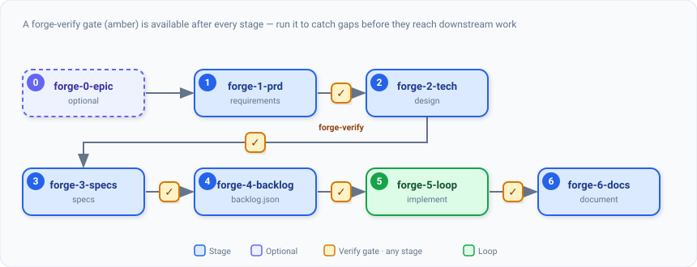

# feature-forge

> Turn a feature idea into shipped, verified code through a fixed, resumable pipeline — works with any coding agent.

[](https://github.com/garygentry/feature-forge/actions/workflows/ci.yml)
[](https://www.npmjs.com/package/@garygentry/feature-forge)
[](LICENSE)
[](#install)
[](https://garygentry.github.io/feature-forge/)

**Full documentation: [garygentry.github.io/feature-forge](https://garygentry.github.io/feature-forge/)** — this README is the quick tour; the docs site is the reference.

> **Using a coding agent?** Let it set feature-forge up for you. Paste this into your session:
>
> > Set up feature-forge in this project — follow
> > `https://raw.githubusercontent.com/garygentry/feature-forge/main/AGENTS-SETUP.md` —
> > then start a PRD for **&lt;my feature&gt;**.
>
> (Or just paste this repo's URL and say "set up feature-forge for me.") The agent installs the
> skills for its own surface, wires the [rauf](https://github.com/garygentry/rauf) loop runner,
> runs `forge-init`, and hands you Stage 1 — pausing only to confirm at a few gates. Prefer to do
> it by hand? The [Install](#install) section below is unchanged.

A feature development pipeline that starts from true _requirements_ (deliberately abstracted from
tech or implementation details) and enforces a structured flow, producing a complete implementation
backlog an agent can process in an autonomous loop.

## Contents

- [How it works](#how-it-works)
- [The pipeline at a glance](#the-pipeline-at-a-glance)
- [Install](#install)
- [Quick Start](#quick-start)
- [Learn more](#learn-more)

## How it works

feature-forge works like a compiler. You start with a vague idea, the agent helps you refine it
through interaction, and each stage narrows it down and adds structure, until the output is a
backlog of self-contained work items an agent can implement without any further context. Each loop
iteration runs with a clean agent context (against artifacts that contain required context) to
maximize results and minimize token consumption.

The stages are kept separate on purpose, so each one does a single job and isn't burdened with unnecessary context:

- **Requirements before design.** Stage 1 captures _what_ the feature must do, never _how_, and
  assigns stable `REQ-XXX-NN` identifiers. Those IDs become a traceability spine: every downstream
  artifact references the requirement it satisfies, and a coverage pass proves nothing was dropped.
- **Verification gates between stages.** A verification pass runs between stages to catch gaps and
  contradictions before they reach downstream stages, where they cost far more to fix.
- **Context hygiene through isolated subagents.** Codebase research, spec authoring, and artifact
  verification run in separate, mostly read-only subagent contexts, so the main session stays
  focused and fast.
- **State that persists across sessions.** Each feature's progress, versions, and commit hashes live
  in a state file, so you can stop, clear context, and pick up where you left off. If you revise an
  upstream artifact, staleness detection flags the downstream stages that depend on it.
- **Stack-aware output.** Built-in profiles for TypeScript, Python, Go, and Rust (with a generic
  fallback) tailor spec conventions, checks, and acceptance criteria to your project's toolchain.
- **An executable backlog, not just documents.** The final artifact is a validated `backlog.json` of
  granular work items. A swappable autonomous loop runner implements them, spawning a fresh agent
  session per item and committing atomically.

It is tuned for Claude but stays agent-agnostic, and runs on any of the supported coding agents.

### The pipeline at a glance

<picture>
  <source media="(prefers-color-scheme: dark)" srcset="docs/images/pipeline-dark.svg" />
  
</picture>

| Stage           | Skill             | Why it exists                                                                                                        |
| --------------- | ----------------- | ------------------------------------------------------------------------------------------------------------------- |
| 0 _(optional)_  | `forge-0-epic`    | Decompose a large change into related member features with declared dependencies and contracts                      |
| 1               | `forge-1-prd`     | Pin down _what_ the feature must do, with stable requirement IDs, before any design decision is made                |
| 2               | `forge-2-tech`    | Decide _how_ to build it, grounding every choice in a specific requirement and in real codebase patterns            |
| 3               | `forge-3-specs`   | Turn decisions into implementation-ready specs (types, signatures, contracts) the loop can build against            |
| 4               | `forge-4-backlog` | Compile the specs into a validated backlog of self-contained, criteria-driven work items                            |
| 5               | `forge-5-loop`    | Implement the backlog autonomously, a fresh agent session per item, committed atomically                            |
| 6               | `forge-6-docs`    | Document the architecture from the _actual_ implementation, for onboarding and maintenance                          |
| ⟳ _(any stage)_ | `forge-verify`    | Catch gaps and contradictions before they reach later stages — available after **any** stage, not just one          |
| ? _(anytime)_   | `forge-guide`     | Advisory helper: explains what forge is, when to use it, and how to configure it — ask instead of running a stage    |

Run `/feature-forge:forge <feature>` at any point to see what's complete, what's next, and what
needs attention. New to the pipeline? Ask `/feature-forge:forge-guide`. Each stage's detail —
inputs, outputs, and behavior — lives on the docs site under
[Pipeline](https://garygentry.github.io/feature-forge/pipeline/overview/).

## Install

### (a) Claude Code (preferred) — marketplace

```bash
# Register the marketplace (one-time)
/plugin marketplace add garygentry/feature-forge

# Install the plugin
/plugin install feature-forge@feature-forge
```

### (b) Any agent — one-liner

Installs the canonical skills into every coding agent detected on your machine:

```bash
npx @garygentry/feature-forge install
```

Scope to one agent with `-a`, or preview without writing using `--dry-run --json`:

```bash
npx @garygentry/feature-forge install -a pi           # one agent
npx @garygentry/feature-forge install --dry-run --json # preview the plan, change nothing
```

### (c) Per-surface setup

| Agent   | Install                                                                                                | Setup doc                                        |
| ------- | ------------------------------------------------------------------------------------------------------ | ------------------------------------------------ |
| Claude  | `/plugin install feature-forge@feature-forge` _(or `npx @garygentry/feature-forge install -a claude`)_ | [docs/agents/claude.md](docs/agents/claude.md)   |
| Codex   | `npx @garygentry/feature-forge install -a codex`                                                       | [docs/agents/codex.md](docs/agents/codex.md)     |
| Copilot | `npx @garygentry/feature-forge install -a copilot`                                                     | [docs/agents/copilot.md](docs/agents/copilot.md) |
| Cursor  | `npx @garygentry/feature-forge install -a cursor`                                                      | [docs/agents/cursor.md](docs/agents/cursor.md)   |
| Gemini  | `npx @garygentry/feature-forge install -a gemini`                                                      | [docs/agents/gemini.md](docs/agents/gemini.md)   |
| Pi      | `npx @garygentry/feature-forge install -a pi`                                                          | [docs/agents/pi.md](docs/agents/pi.md)           |

> **Stale or partial install?** If a skill reports `feature-forge: install incomplete/degraded …
> (missing …)`, the bundled `scripts/`/`references/` under your agent's skill dir are out of date or
> were only partially extracted — the resolver refuses to run degraded rather than silently
> improvising. Re-run the installer above (or `feature-forge update`) to restore the full bundle.

> The default loop runner (`forge-5-loop`) is **rauf**, published as
> [`@garygentry/rauf`](https://www.npmjs.com/package/@garygentry/rauf). Install the rauf CLI with
> `npx @garygentry/rauf` (or `npm i -g @garygentry/rauf`). See
> [docs/agents/claude.md#the-default-loop-runner](docs/agents/claude.md#the-default-loop-runner) for
> the full default loop path and agent-selection precedence.

## Quick Start

```
1. /feature-forge:forge-init                        # Create forge.config.json
2. /feature-forge:forge-1-prd user-authentication    # Start with requirements
3. /feature-forge:forge user-authentication          # Check status anytime
```

The pipeline guides you through each subsequent stage. Run `/feature-forge:forge <feature>` at any point to see what's complete, what's next, and what needs attention.

## Learn more

The [documentation site](https://garygentry.github.io/feature-forge/) is the reference; it always
reflects the shipped canon. Jump straight to:

- **[Pipeline stages](https://garygentry.github.io/feature-forge/pipeline/overview/)** — what each stage consumes, produces, and does, stage by stage.
- **[Verify & fix](https://garygentry.github.io/feature-forge/pipeline/verify-and-fix/)** — the `forge-verify` / `forge-fix` gate available after any stage.
- **[Dashboard & navigator](https://garygentry.github.io/feature-forge/pipeline/dashboard/)** —
  driving a feature stage to stage, plus
  [sessions & monitoring](https://garygentry.github.io/feature-forge/pipeline/sessions-and-monitoring/)
  and [managing context](https://garygentry.github.io/feature-forge/pipeline/managing-context/).
- **[Configuration](https://garygentry.github.io/feature-forge/advanced/config/)** — every
  `forge.config.json` key, including auto-verify, auto-fix, and the `loopRunner` block.
- **[Epics](https://garygentry.github.io/feature-forge/advanced/epics/)** — decompose a large change
  into member features (Stage 0). Deep dive:
  [docs/architecture/epic-orchestration/README.md](docs/architecture/epic-orchestration/README.md).
- **[Concepts](https://garygentry.github.io/feature-forge/start-here/concepts/)** — pipeline state, staleness detection, stack profiles, and the traceability spine.
- **[Troubleshooting](https://garygentry.github.io/feature-forge/reference/troubleshooting/)** and the [doctor checks](https://garygentry.github.io/feature-forge/reference/doctor-checks/) reference.

The loop runner is swappable: feature-forge binds to it only through the `loopRunner` block in
`forge.config.json`. See [`references/ralph-loop-contract.md`](references/ralph-loop-contract.md) for
the contract. **Contributing to feature-forge itself?** Start with [`CONTRIBUTING.md`](CONTRIBUTING.md).
