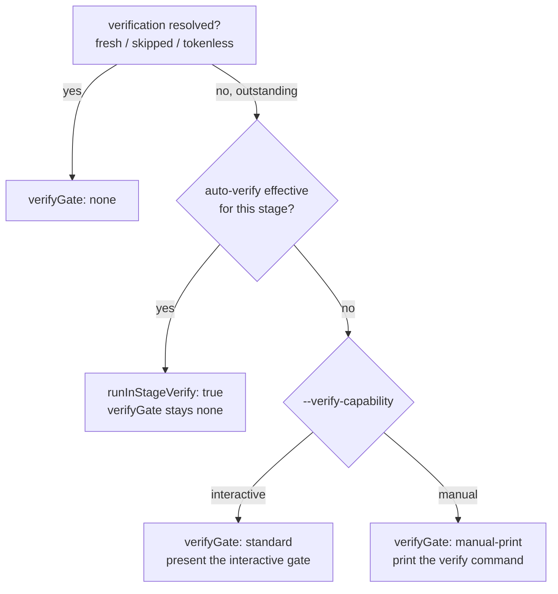

# Architecture

Stage Exit Coverage moves the entire stage-closing decision out of skill prose and into one
deterministic function. This document explains that function's design: what it emits, the
order it validates in, and how each of the four failure modes it was built to fix is closed.

## Design principle: the script decides, the skill obeys

The old model asked each skill to *reason* about its close — is verification fresh? which
gate? what's the next command on this host? — and write a bespoke "Next steps:" list. Two
skills reasoning about the same thing drift, and a branch skill reasoning about a thread it
served can drop it.

The new model inverts that. `stage_exit()` in `scripts/forge-session.py` computes every
conditional and returns a `StageExitPayload`:

```
StageExitPayload
├── directives : StageExitDirectives   # the machine-readable decisions
├── nextSteps  : str | None            # the rendered terminal block (direct owner only)
└── sentinel   : str | None            # "─ forge: end of stage ─" when this call owns the block
```

The skill's only job is to execute the directives in a fixed order and, if it owns the
terminal block, print `nextSteps` verbatim. Everything that used to be a judgement call is
now data. This is what makes byte-identical output achievable for identical inputs
(REQ-REL-01) and what lets a single drift guard assert the contract.

## The directive payload

`StageExitDirectives` is a `total=False` TypedDict — a key's **absence** means "not
applicable to this exit," which is never the same as a present-but-null value
(`servedStage: None` says "resolved no served stage"; a missing `servedStage` says "the
concept does not apply"). The load-bearing fields:

| Field | Meaning |
|-------|---------|
| `stage`, `feature`, `host` | Identity. Always present. `host` is resolved here and never re-inferred downstream. |
| `stageNoun` | Human noun for the artifact, filling `{stageNoun}` slots in gate labels and headings. |
| `servedStage` | The production stage a verify/fix diversion served and rejoins. `None` on a production exit (it serves only itself). |
| `verifyMode`, `outcome`, `owner` | Branch metadata. `owner` is `direct`/`nested` for branch skills, rejected for stages 0–6. |
| `terminalOwnedBy` | `"self"` (print exactly one block) or `"outer"` (print nothing terminal). |
| `verifyState` | Freshness of the routed stage's verification: `fresh`, `stale`, `failing`, `never`, `auto-pending`, `skipped`, `none`. |
| `verifyStage`, `verifyCommand` | The stage outstanding verification is owed on, and the host-rendered command to run it. |
| `verifyGate` | Which gate form to render: `none`, `standard`, or `manual-print`. |
| `runInStageVerify` | True when the caller must run in-stage verify before returning control. |
| `autoVerifyEffective`, `autoFixEligible` | Effective per-stage auto-verify, and whether an unattended auto-fix chain may run. |
| `autoVerifyDebtRecorded` | True iff the `auto-verify-pending` marker is durably on disk. |
| `primaryCommand`, `deferredCommand` | The verify-first pair: the one fenced command, and the demoted follow-up prose. |
| `nextStage`, `nextCommand` | Routing/compatibility metadata; never promoted over `primaryCommand`. |
| `invalidAutoVerifyKeys`, `warnings` | Advisory lists in a fixed, deterministic order (`[]` = checked-and-clean, distinct from absent). |
| `gitRepo`, `cleanTree` | Pre-mutation snapshots of the working tree. `cleanTree` is `None` when not a git repo. |
| `epicReconcile` | Epic-backflow directive; absent for standalone features. |

A critical detail for reasoning about this payload: **every field except
`autoVerifyDebtRecorded` is a pre-mutation snapshot.** They describe the state the routing
decision was made *from*. That is why a first exit reports `verifyState: never` while the
debt it just recorded reads `auto-pending` on the *next* exit — only
`autoVerifyDebtRecorded` reports what the current call's write did.

## Deterministic validation order

`stage_exit()` validates fail-closed, in a fixed order, before it reads any state. Each
check raises `UsageError` → exit 2 with the `Error:` line on stderr, no payload, and no
sentinel — so a bad invocation can never emit a guessed next step (REQ-REL-02):

1. **Safe names & containment** — `--feature`, `--epic`, `--next-feature` are rejected for
   path separators, `..`, and unsafe characters before any filesystem access (REQ-SEC-01).
2. **Stage domain** — `--stage` must be one of the nine `EXIT_STAGES`.
3. **Outcome domain** — stages 0–4 reject `--outcome`; `forge-5-loop`, `forge-6-docs`,
   `forge-verify`, `forge-fix` each require it from their own enum in `EXIT_OUTCOMES`.
   (argparse cannot express a different enum per stage, so this is validated in the function.)
4. **Ownership** — required for the two branch skills, rejected for stages 0–6 (always
   direct owners).
5. **Host & capability** — validated independently; a host never implies a capability.
6. **Served-stage flags** — `--served-stage`/`--verify-mode` are branch-only and rejected
   on a production stage; `--next-feature` is `forge-0-epic`-only.

Only after all six pass does the function read config and state and begin routing.

## Verify-first ordering

The most consequential behavior change, applied to **every** covered exit (including the
previously-scripted stages 0–4): while a stage's verification is `never`, `stale`,
`failing`, or `auto-pending` — outstanding and not explicitly skipped — the *verify* command
is `primaryCommand` and is the only fenced action in the block. The production successor is
carried as `deferredCommand` and rendered as unfenced "after verification passes" prose.

`nextStage`/`nextCommand` remain in the payload as routing metadata but **never** override
`primaryCommand` (REQ-EXIT-06). This makes it structurally impossible for a skill to present
the downstream stage as the next action while a verify is owed. Advancement resumes only
after a pass, or after an explicit `skipped` has been persisted through `state-verify`.

## Host vs. capability, and gate selection

`--host` and `--verify-capability` are computed independently and the script takes each at
face value. Gate selection is a pure function of verify state and capability — **never** of
the host:



A capable Pi session (`--host pi --verify-capability interactive`) gets the same `standard`
gate a capable Claude session does; an incapable Claude session
(`--host claude --verify-capability manual`) gets `manual-print` (REQ-EXIT-07). The value of
`--verify-capability` is the *caller's* determination of whether it may dispatch a
clean-room verifier right now — a permission question, not a tool-presence question. A
session that may dispatch only once the user has asked is still `interactive`, because the
`standard` gate's own prompt supplies that request.

## The scheduling boundary and auto-verify debt

`auto-verify-pending` exists to answer one question left ambiguous before this feature: *was
a verify owed and dropped, or never scheduled at all?* (#163). The two look identical if
nothing records the obligation.

The fix is a **scheduling boundary**. When in-stage auto-verify is effective for the routed
stage (`run_in_stage` is true), the script writes the `auto-verify-pending` marker to
pipeline state **before** the payload that carries `runInStageVerify: true` is built:

```
run_in_stage = effective_auto_verify
               and not resolved            # verify not already fresh/skipped/none
               and stage not in branch      # a branch exit is already inside verification
               and not loop_incomplete      # an unfinished loop owes no impl verify yet
```

Because the write lands first:

- A crash, compaction, or model non-adherence between scheduling and dispatch leaves durable
  state exposing the obligation (REQ-REL-03, REQ-DEBT-04).
- A failed debt write raises `UsageError` and returns **no payload at all** — so the
  combination `runInStageVerify: true` with `autoVerifyDebtRecorded: false` is *unreachable*.
  The field is carried anyway so tests and tools can assert the invariant rather than infer it.
- Scheduling is **idempotent by target revision**: a repeat exit at the same stage version
  touches neither `scheduledAt` nor the top-level `updatedAt`.

A verify result later replaces the marker with `passed`, `findings-reported`,
`findings-applied`, or `skipped` through the normal `state-verify` write path (REQ-DEBT-03).
The navigator, `stage-exit`, status rendering, and downstream pre-flight checks all classify
`auto-verify-pending` as **outstanding** (the `auto-pending` label), never as ordinary
`never` and never as a terminal pass (REQ-DEBT-05). Older state files that predate the status
load unchanged with their current meaning — no migration (REQ-DEBT-06).

`autoFixEligible` folds in the config `autoFix` flag, the in-stage verify actually running,
and a **clean working tree** — and that clean-tree snapshot is taken *before* the debt write,
so the sanctioned control-plane mutation cannot dirty its own precondition.

## Branch diversion and rejoin

`forge-verify` and `forge-fix` are diversions: they have no artifact, no verify token, and no
successor of their own. `route_stage` is therefore the **served** stage, not the branch skill:

```
route_stage = resolved_served if resolved_served is not None else stage
```

`resolve_served_stage()` takes `--served-stage` directly, or infers it from `--verify-mode`
via `VERIFY_MODE_TO_STAGE` when that mapping is unique, and raises if neither is available or
they conflict (REQ-ROUTE-01/02/03). From there the outcome tables in `_branch_route` — not
verify-first ordering — supply `primaryCommand`:

- a **clean verify** returns to the next applicable production action;
- **verify findings** route to `forge-fix`;
- a **fix that needs re-verification** routes to re-verify before advancing;
- and every recovery/defer route carries `--served-stage` forward so the thread survives
  (REQ-ROUTE-04/05/06, #176).

A branch exit never owes an in-stage verify chain and never schedules debt: it is already
*inside* the verification diversion. Without that guard, a `forge-verify --outcome findings`
exit would both re-dispatch itself and overwrite the `findings-reported` entry it had just
written with a fresh `auto-verify-pending` marker, losing the report (REQ-EXIT-04).

## Loop and docs: routing from live state

Two production exits deliberately do **not** use the fixed successor table.

**`forge-5-loop`** routes by its required `--outcome`. Only `complete` keeps verify-first
ordering in front of the documentation/epic handoff. The other five outcomes
(`partial`/`deferred`/`resolved` → resume the loop; `blocked`/`needs-human` → the
navigator) suppress
*every* downstream signal — `nextStage`/`nextCommand` are `None`, `runInStageVerify` is
`false`, no debt is scheduled, and `verifyGate` is `none`. A loop still in flight has no
finished implementation to verify and nothing downstream may read as ready (REQ-PROD-02).

**`forge-6-docs`** decides its terminus from **live epic state**, never the successor table.
For an epic member it calls `epic-manifest.py render-status` and routes to the next actionable
member's own command; anything else routes to the epic dashboard; a `blocked` outcome routes
to recovery and never claims completion. Any helper failure is an actionable `UsageError`
(exit 2, no payload) — so no guessed member command and no sentinel can escape (REQ-PROD-04,
REQ-REL-02).

**Epic edit-mode (`forge-0-epic` with `--next-feature`)** resolves the *selected* member's
live progress via `next_stage` and routes to where that member actually is. A progressed
member resumes at its real stage instead of being sent back to `forge-1-prd` (#175); a fully
complete member hands back to the epic dashboard; a member whose state cannot be resolved
degrades safely to `forge-1-prd` with a `warnings` entry naming it and the reason
(REQ-PROD-05/06).

## State and provenance integrity

- **Full commit hashes.** New scripted `commitHash` writes are validated against
  `FULL_GIT_HASH_RE` — 40 hex characters (REQ-STATE-01). Legacy state carrying a short hash
  still *loads* (this validates writes, not reads) and is not rejected (REQ-STATE-02).
- **Two-commit provenance, never amend.** The exit preserves the repository's two-commit
  protocol: the artifact commit records `commitHash: null`, and a second write records the
  hash of that commit. `git commit --amend` is never used — it would rewrite HEAD and orphan
  the recorded hash (REQ-STATE-04).
- **Atomic, targeted writers.** Every state mutation this feature adds goes through a
  `state-*` verb (sibling temp file, flush/fsync, `os.replace`). No path round-trips
  model-authored JSON (REQ-STATE-03).
- **Single-writer model.** Atomicity protects against an *interrupted* write by one writer;
  it is not mutual exclusion between writers. Concurrent state-mutating sessions are out of
  scope, matching the repository-wide invariant. No locking, leasing, or optimistic
  versioning is introduced (REQ-REL-04).

## Configuration diagnostics: duplicate keys

`load_json_with_duplicates()` parses `forge.config.json` with an `object_pairs_hook` that
records every duplicated object key in decoder order, and `warn_duplicate_keys()` emits one
warning per duplicate occurrence naming the key. This is applied through the **shared**
config-reading path used by `effective-config`, `stage-exit`, init/validation, and other
consumers, so the warning is consistent everywhere (REQ-CONFIG-01/02). It is general
JSON-object behavior, not an `autoVerify` special case (REQ-CONFIG-04), and it stays
**warning-only** — the effective value keeps today's last-key-wins semantics (REQ-CONFIG-03).
The same duplicate-aware loader is *mirrored* (not imported) into `forge-bootstrap.py`,
because the flat scripts share no import module; `tests/test_json_loader_parity.py` guards
the two copies against drift.

## Further Reading

- [README](./README.md) — what the feature is, the failures it fixes, and key concepts.
- [CLI Reference](./cli-reference.md) — every `stage-exit` flag, the per-stage matrix, and exit codes.
- [Integration Guide](./guides/integration.md) — consuming directives in order and extending coverage.
