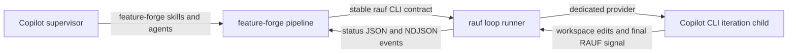

# First-Class GitHub Copilot Support in Rauf

Status: Phases 1 and 2 complete; Phase 3 provider-aware propagation next
Created: 2026-08-23
Owners: rauf and feature-forge maintainers
Target: GitHub Copilot CLI, GitHub Copilot in VS Code, and Copilot Agent Host

> **Tracking:** `unified-copilot-adaptation-plan.md` controls sequencing and completion. This file
> retains rauf design detail and local subtask status. See `README.md` before resuming.

## 1. Purpose

Remediate the sibling `rauf` repository so it supports GitHub Copilot in both roles it
occupies in the feature-forge system:

1. **Iteration runtime:** `rauf loop run --agent copilot` launches the current Copilot CLI
   through a dedicated, tested provider with deterministic non-interactive behavior,
   structured output, safe permissions, model handling, cancellation, and RAUF signal parsing.
2. **Agent customization package:** rauf's canonical operator skills and focused agents are
   emitted as native Copilot skills, custom agents, and an Agent Plugins 1.0 bundle rather than
   relying only on a generic `AGENTS.md` fallback.

This is a rauf-focused companion to `copilot-adapter-full-support.md`. The plans remain separately
executable so ownership and release boundaries stay clear. Their shared decisions and ordered
cross-repository backlog now live in `unified-copilot-adaptation-plan.md`.

This document is a plan, not implementation. It records verified current behavior, proposed
boundaries, phased work, tests, open decisions, and the contract feature-forge may rely on.

## 2. Evidence and Current State

### 2.1 Evidence captured on 2026-08-23

The installed CLI is `GitHub Copilot CLI 1.0.78`. Its top-level help confirms these relevant
surfaces:

- `-p, --prompt <text>` for explicit non-interactive execution.
- `--output-format json` for JSONL output and `--stream on|off`.
- `--allow-all-tools`, `--allow-tool`, `--deny-tool`, `--allow-all-paths`, and URL controls.
- `--no-ask-user` for unattended sessions.
- `--no-auto-update`, `--no-remote`, and `--no-remote-export` for deterministic child sessions.
- `--model`, `--effort`, `--context`, and `--agent` for session selection.
- `--plugin-dir`, plus `plugin`, `plugins`, and `skill` management commands.
- `-C <directory>` and `--add-dir <directory>` for filesystem scope.

Any implementation must re-run and record these probes against the minimum supported Copilot
CLI version. Help text is evidence of syntax, not evidence that a complete autonomous coding
iteration works.

### 2.2 Existing rauf runtime support

Rauf already has a provider-neutral loop seam:

1. `LoopRunner` resolves an agent id by item, run, project, global, then default precedence.
2. The provider registry constructs an `LLMProvider` and probes availability before state is
   mutated.
3. `provider.execute()` returns an `ExecutionResult`.
4. Reconstructed or plain output is neutralized and parsed for the final RAUF signal.
5. The runner owns git reconciliation and commit behavior after a valid `RAUF_DONE`.

The current `copilot` support is a generic `CliAgentConfig` preset in
`packages/loop/src/providers/presets.ts`:

| Property | Current value |
| --- | --- |
| Provider id | `copilot` |
| Binary | `copilot` |
| Prompt delivery | stdin |
| Non-interactive flags | `--allow-all-tools` |
| Model flag | `--model <value>` |
| Output | Plain text only |
| Telemetry | None |
| Ask-user handling | Unspecified |
| Path/URL policy | Unspecified |
| Session/update/remote policy | Unspecified |

The preset was real-CLI verified against Copilot CLI 1.0.65 on 2026-06-27, but it does not use
the richer current CLI contract. It also has no dedicated parser or fixtures. This is the same
class of risk that required Codex to be promoted from a generic preset to
`CodexCliProvider` after real CLI argv and output behavior diverged.

### 2.3 Existing rauf harness adaptation

Rauf already maintains useful canonical surfaces:

- Operator skills under `skills/<name>/SKILL.md`.
- Focused agents under `agents/<name>.md`.
- A Claude plugin at `.claude-plugin/`.
- Generated Codex skills at `.codex-plugin/` and agents at `.codex/agents/`.
- A generated Pi package under `adapters/pi/`.
- A host-neutral managed block installed into project `AGENTS.md`.
- A separate Claude-specific managed block installed into `CLAUDE.md`.

There is no generated Copilot plugin, no `.github/skills` or `.github/agents` output, no
Copilot custom-agent metadata mapping, and no Copilot drift check in `pnpm gate`.

### 2.4 Known adjacent drift to correct while touching these surfaces

- `docs/architecture/rauf-agent-cli-adapters/README.md` still describes Codex as a generic
  preset and counts four presets, although Codex now has a dedicated provider and Pi is shipped.
- `docs/architecture/rauf-agent-cli-adapters/architecture.md` contains the same stale preset
  table and generic-engine description.
- `docs/ARCHITECTURE.md` still describes direct `spawnClaude` behavior in the main loop.
- `docs/SPEC-CLI.md` uses Claude-specific wording for provider-neutral run/review paths.
- Installer preflight reports that `claude` is required even when the project is intended to
  use Copilot or another registered provider.
- Canonical authoring guidance still names the Claude `Task` tool in some delegation prose;
  Copilot output needs host-neutral wording or a generated Copilot overlay.

## 3. Goals

### G1. Correct Copilot CLI execution

`rauf loop run --agent copilot` uses a dedicated provider whose argv, prompt transport,
working directory, permission policy, output parsing, cancellation, and exit behavior are
verified against the real supported CLI.

### G2. Reliable signal and telemetry behavior

Copilot JSONL output is parsed into reconstructed final text for RAUF signal detection and,
where the upstream stream exposes it, provider-neutral tool/token/progress events.

### G3. Safe unattended operation

Copilot cannot hang waiting for a tool approval or an `ask_user` response. The child has enough
authority to edit and verify the target workspace, but the default policy does not grant
unbounded filesystem, URL, remote-session, commit, or push authority without an explicit
decision.

### G4. Portable model selection

Copilot inherits its default model when no compatible model is selected. Claude-only backlog
aliases do not accidentally flow into Copilot in the documented integrated path.

### G5. Native Copilot customization

Rauf's canonical skills and focused agents are discoverable as native Copilot customizations
through deterministic generated output and a valid Agent Plugins 1.0 package.

### G6. Preserve rauf's public contracts

The provider id remains `copilot`; provider precedence, backlog schema, RAUF signals, event
names, exit codes, git ownership, and feature-forge's Part-A runner contract remain compatible.

### G7. Cross-repository proof

A smoke scenario proves that feature-forge can prepare a backlog, invoke rauf with Copilot,
observe the stable machine surfaces, and complete or pause for human input without depending on
Claude-specific behavior.

## 4. Non-Goals

- Replacing rauf's provider registry or Part-A backlog/runner protocol.
- Changing the default provider from `claude-cli` as part of this remediation.
- Translating arbitrary model names between vendors.
- Giving the iteration child responsibility for git commits or backlog/state mutation.
- Making Copilot-specific fields part of the portable backlog schema.
- Deploying rauf's operator skills and custom agents into every target project during
  `rauf install` without a separate product decision.
- Removing Claude, Codex, Gemini, Cursor, Pi, or generic CLI support.
- Publishing either repository automatically after merge.

## 5. Cross-Repository Boundary

The integrated system has three distinct processes. Keeping them separate prevents tool and
signal confusion:



Ownership rules:

- **feature-forge** owns planning stages, generated feature artifacts, and orchestration of the
  external runner.
- **rauf** owns backlog validation, provider selection, iteration lifecycle, stable status/event
  surfaces, signal interpretation, recovery, and commits.
- **Copilot iteration child** owns only the current item implementation and verification. It
  must not edit `backlog.json` or `state.json`, commit, push, supervise its own loop, or emit a
  supervisor-only review signal during a normal iteration.
- **Copilot supervisor** may use rauf's `rauf-loop-driver` custom agent; the iteration child may
  not delegate loop supervision back to it.

The plans share these decisions and should be reviewed together before implementation:

1. Minimum tested Copilot CLI version and compatibility policy.
2. Agent Plugins 1.0 manifest shape and generated directory conventions.
3. Canonical-to-Copilot custom-agent tool aliases.
4. Plugin versus direct-install command naming.
5. Runtime smoke fixtures and how authenticated tests are gated.
6. The exact feature-forge invocation contract for Copilot-backed loops.

## 6. Proposed Architecture

### 6.1 Dedicated `CopilotCliProvider`

Promote `copilot` out of `PRESET_CONFIGS` into a dedicated provider, following the proven
Codex pattern:

```text
packages/loop/src/providers/
  copilot-cli.ts
  copilot-cli.test.ts
  copilot-jsonl-parser.ts
  copilot-jsonl-parser.test.ts
  __fixtures__/
    copilot-*.jsonl
```

The provider keeps the stable id `copilot` and registers the `copilot` binary. The side-effect
import in `providers/index.ts` must make registration deterministic, with only one owner of that
id.

The intended command shape is:

```text
copilot <determinism flags> <permission flags> --output-format json \
  [--model <model>] <verified prompt-delivery form>
```

Do not freeze the exact argv until Phase 0 verifies it. In particular:

- Prove whether explicit `-p` can accept a large prompt without putting the full prompt in argv.
- Prefer stdin or a safe file mechanism if supported; rauf prompts can exceed OS argv limits.
- Verify whether `--stream on` is required for incremental JSONL chunks.
- Verify whether `--silent` is compatible with JSONL and preserves the final response.
- Verify the minimum workspace-path permission needed when `cwd` is already the project root.
- Verify which stderr/JSON records represent auth, model, permission, credit, or usage failures.

### 6.2 Provider-neutral stream types

The common provider API currently names its callback payload `ClaudeStreamEvent`, even though the
Codex parser also emits it. Before adding a third structured parser, rename the internal type to a
provider-neutral name such as `AgentStreamEvent` and retain a compatibility alias if it is part of
the exported package surface.

This is an internal/type-level cleanup only. It must not rename rauf's stable external
`llm_tool_activity`, `llm_token_update`, or lifecycle event types.

The Copilot parser should:

- Ignore malformed and unknown JSONL records without crashing the loop.
- Reconstruct only assistant/final response text used for RAUF signal detection.
- Emit tool start/end events when stable identifiers exist.
- Emit token updates only when the CLI reports reliable usage fields.
- Preserve stderr and raw stdout for diagnostics.
- Flush a final unterminated JSONL line.
- Treat parser callback failures as non-fatal.
- Use sanitized real-CLI fixtures with the captured Copilot version recorded in comments.

### 6.3 Permission and autonomy policy

The provider should own a named, testable permission policy rather than appending
`--allow-all-tools` ad hoc. The initial target is:

- Non-interactive execution with `--no-ask-user`.
- Workspace-scoped read, edit, and command execution.
- No implicit access outside the project root.
- No implicit network/URL expansion beyond what a documented task requires.
- No remote control or remote export for loop child sessions.
- No automatic CLI update during an iteration.
- Deny child `git commit` and `git push` when Copilot's tool-pattern syntax can enforce that
  reliably; rauf remains the commit owner regardless.

If the current CLI cannot express the intended least-privilege policy without breaking normal
coding tasks, document the gap and expose an explicit policy choice. Do not silently change the
default to `--allow-all` or `--yolo`.

### 6.4 Configuration surface

Keep `provider: "copilot"` as the portable selection value. Add only typed Copilot options that
are proven necessary, rather than forwarding arbitrary argv from project files.

Candidate options for a dedicated provider config:

- Permission profile: workspace/default versus explicitly unrestricted.
- Copilot custom-agent name, if iteration-specific agents are adopted later.
- Reasoning effort or context tier.
- Additional allowed directories, with containment validation.
- JSONL versus degraded text fallback for compatibility testing.

Unknown config keys should fail validation or be reported; they must not become unreviewed CLI
flags. Secrets must remain in Copilot's authentication store/environment and must never be
persisted in `.rauf.json`, logs, events, or fixtures.

### 6.5 Generated Copilot customization bundle

Generate rauf's Copilot package from the same canonical `skills/` and `agents/` sources used by
other adapters:

```text
adapters/copilot/
  plugin.json
  COPILOT-BUNDLE-REPORT.md
  skills/
    author-backlog/SKILL.md
    drive-rauf-loop/SKILL.md
    review-backlog/SKILL.md
    review-rauf-guidance/SKILL.md
      agents/
            rauf-backlog-reviewer.agent.md
            rauf-loop-driver.agent.md
```

For repository-local Copilot development, choose during Phase 4 between:

1. Generated mirrors under `.github/skills/` and `.github/agents/`.
2. Installing `adapters/copilot/` through Copilot's cached plugin lifecycle and VS Code's plugin
       flow. Copilot CLI 1.0.78 `--plugin-dir` loads agents but omits plugin skills, so it is not
       sufficient discovery proof.
3. Both, if direct repository discovery and distributable plugin behavior cannot share one root.

Generated files must carry provenance and be protected by a `--check` drift gate. Canonical
prose should become host-neutral where that improves every adapter; a Copilot overlay should be
used where the behavior is genuinely host-specific.

### 6.6 Installed project guidance

Continue installing the host-neutral rauf block into `AGENTS.md`; Copilot already recognizes that
surface. Keep the Claude-specific `CLAUDE.md` block independent.

Do not make `rauf install` copy the operator plugin by default. The installed `AGENTS.md` and
`.rauf/RAUF.md` govern the iteration child, while the optional rauf plugin governs a supervisor
operating rauf. Mixing those roles would expose supervisor commands to the child and complicate
uninstall ownership.

## 7. Work Plan

### Phase 0: Freeze the real Copilot CLI contract

Status: Complete; unified `COP-004`, `COP-005`, and G2 closed on 2026-08-23

Primary surfaces:

- Copilot CLI help and authenticated smoke environment.
- `packages/loop/src/providers/presets.ts` as the behavior being replaced.
- A new dated design note or fixture README under rauf's provider tests.

Tasks:

- [x] Record `copilot --version`, `copilot --help`, and plugin/skill subcommand help for CLI 1.0.78;
      unified `COP-002` freezes it as the minimum under a floor-plus-current policy.
- [x] Verify the current environment can complete an authenticated prompt without recording credentials.
- [x] Run a no-tool sentinel prompt and capture structured JSONL output with a final assistant response.
- [x] Run a workspace-write smoke in a temporary git repository and confirm the changed file.
- [x] Run a verification-command smoke to prove shell execution works without approval prompts.
      Evidence (2026-08-23): `evidence/copilot-cli-child-contract-2026-08-23.md` records an exit-0
      JSONL run that created the exact marker, emitted `create` and `bash` tool lifecycles, returned
      the exact final sentinel, and produced no stderr.
- [x] Run a needs-human smoke and prove `--no-ask-user` leads to `RAUF_NEEDS_HUMAN` rather than
      an interactive hang when instructed by `.rauf/RAUF.md`.
- [x] Measure prompt-delivery behavior with a prompt large enough to expose argv limits.
      Evidence (2026-08-23): direct 3 MiB argv transport failed with `E2BIG` against a 2 MiB
      `ARG_MAX`; a 131,103-byte workspace-owned prompt file loaded through a short fixed bootstrap
      and ended with the required signal. Use bounded file indirection, never the full prompt argv.
- [x] Probe cancellation, timeout, SIGTERM/process-group cleanup, and a trailing partial JSONL line.
      Evidence (2026-08-23): timeout, AbortSignal, and explicit shutdown all terminate the detached
      process group with no marked descendant; the parser flushes a valid unterminated final record.
- [x] Probe invalid model, unauthenticated, permission-denied, credit/usage-limited, and malformed
      output cases; record exit codes and output channels.
      Evidence (2026-08-23): invalid model and isolated auth exit before JSONL; permission denial is
      in-band with exit 0; malformed-only output reconstructs no final text. Usage records expose
      consumption but no stable balance/reset preflight, so `checkUsage` remains unsupported.
- [x] Verify nested execution from a Copilot-driven parent session, including inherited
      `COPILOT_*` environment variables and any nested-session guard.
      Evidence (2026-08-23): a Copilot parent successfully invoked a workspace-local detached
      boundary, which filtered parent session markers and launched a clean child. Direct wrapper
      recursion was denied. The same boundary passed from the current VS Code/Agent Host terminal.
- [x] Decide and document the default permission profile.
      Evidence (2026-08-23): named read/write/shell grants, commit/push denials, workspace path
      verification, no URL grants, no ask/update/remote/custom-instruction/built-in-MCP behavior,
      JSONL streaming, optional model, and bounded prompt-file bootstrap are frozen in the evidence.

Exit criteria:

- The exact argv order, prompt transport, JSONL schema, permission behavior, failure taxonomy,
  and supported-version floor are backed by dated real-CLI evidence.
- No implementation decision depends only on help text or unit-test mocks.

Exit evidence: `evidence/copilot-cli-child-contract-2026-08-23.md`. Phase 1 may now begin at the
provider-neutral stream type and parser; no rauf implementation changed during contract freeze.

### Phase 1: Add the dedicated Copilot provider

Status: Complete; dedicated provider registered and generic preset removed

Primary files in `../rauf`:

- `packages/loop/src/providers/copilot-cli.ts` (new)
- `packages/loop/src/providers/copilot-cli.test.ts` (new)
- `packages/loop/src/providers/copilot-jsonl-parser.ts` (new)
- `packages/loop/src/providers/copilot-jsonl-parser.test.ts` (new)
- `packages/loop/src/providers/__fixtures__/copilot-*.jsonl` (new)
- `packages/loop/src/providers/presets.ts`
- `packages/loop/src/providers/presets.test.ts`
- `packages/loop/src/providers/index.ts`
- `packages/loop/src/providers/types.ts`
- `packages/loop/src/stream-parser.ts`

Tasks:

- [x] Rename the shared stream callback type to a provider-neutral name, preserving an alias if
      needed for package compatibility.
      Evidence (2026-08-23): `AgentStreamEvent` is canonical across internal consumers;
      `ClaudeStreamEvent` remains a deprecated exported alias. The loop package typecheck and 25
      focused stream/Codex tests pass, followed by loop lint, formatting, and all 408 loop tests,
      with no external event discriminator changes. Committed on rauf branch
      `feat/copilot-g2-contract` as `45603b1`.
- [x] Implement the JSONL parser from captured fixtures.
      Evidence (2026-08-23): the incremental parser reconstructs only
      `assistant.message.data.content`, owns chunk buffering and final-record flush, preserves raw
      stdout, pairs schema-backed tool lifecycle events, ignores malformed/unknown and hostile
      non-assistant records, and contains callback failures. Usage records do not emit token events
      because no reliable input/output-token fields were captured. The focused three-parser suite
      passed 23 tests; loop typecheck, lint, and changed-file formatting passed. Committed as
      `921971c` on `feat/copilot-g2-contract`.
- [x] Implement `CopilotCliProvider` with the verified argv and large-prompt-safe transport.
- [x] Forward `ExecuteOptions.env`, timeout, abort signal, cwd, model, and stream callbacks.
- [x] Implement the selected permission/autonomy policy as explicit argv construction.
- [x] Reconstruct final response text for RAUF signal parsing.
- [x] Keep raw stdout/stderr and process outcome fields intact.
      Evidence (2026-08-23): the provider writes the full prompt to a private package-owned
      workspace path, passes only a bounded file-loading bootstrap in argv, and removes the path
      in `finally` across success, failure, timeout, and cancellation outcomes. It applies the
      frozen 1.0.78 flags, filters inherited Copilot session controls, forwards process controls,
      parses JSONL through `CopilotJsonlParser`, and returns untouched raw process fields plus
      reconstructed assistant text. The focused provider/parser/process suite passed 48 tests;
      loop typecheck, changed-file lint, and formatting passed. Committed as `d63cdc4` on
      `feat/copilot-g2-contract`.
- [x] Register the dedicated provider under the existing `copilot` id.
- [x] Remove `copilot` from generic `PRESET_CONFIGS` and update preset counts/tests.
- [x] Keep PATH detection non-throwing; add an auth-aware probe only if Phase 0 finds a stable,
      non-secret, non-mutating mechanism.
- [x] Ensure unknown JSONL event types and callback exceptions cannot crash an iteration.

Evidence (2026-08-23): rauf commit `a4f50e0` atomically moved the stable `copilot` id from the
generic preset array to the dedicated provider's descriptor. A default-registry test proves one
descriptor and dedicated construction; selection tests preserve item, project, and global values.
The focused registry/preset/selection suite passed 52 tests, the full provider/selection suite
passed 116 tests, and loop typecheck, changed-file lint, and formatting passed.

Exit criteria:

- Provider unit tests prove exact argv ordering, prompt isolation from argv, environment
  propagation, timeout/cancel wiring, model omission/forwarding, parser reconstruction, and
  malformed-stream tolerance.
- `getAgentDescriptors()` contains one and only one `copilot` descriptor.
- Existing Claude, Codex, generic, Gemini, Cursor, and Pi provider tests remain green.

### Phase 2: Integrate runtime safety and failure classification

Status: Complete; failure, ownership, runtime, topology, and observability matrix passed

Primary files in `../rauf`:

- `packages/loop/src/runner.ts`
- `packages/loop/src/exit-classifier.ts`
- `packages/loop/src/providers/types.ts`
- `packages/loop/src/runner.test.ts`
- `packages/loop/src/stream-integration.test.ts`
- `packages/loop/src/exit-classifier.test.ts`
- `test-sandbox/`

Tasks:

- [x] Prove normal work and review passes both use the dedicated Copilot provider.
- [x] Preserve final-line RAUF signal neutralization and last-signal-wins behavior on
      reconstructed Copilot text.
- [x] Map Copilot auth, invalid-model, permission, credit/usage, timeout, and infrastructure
      failures into existing runner outcomes without routing them through Claude OAuth logic.
- [x] Decide whether any Copilot limit can implement provider-specific `checkUsage`; otherwise
      classify it as a documented non-Claude failure and keep the item recoverable where possible.
- [x] Ensure missing/malformed final messages cannot produce a false `RAUF_DONE`.
- [x] Prove the child cannot commit or push under the selected default policy, while rauf's
      post-signal commit still works.
- [x] Add mock-Copilot sandbox scenarios for done, blocked, needs-human, no signal, malformed
      JSONL, and non-zero exit; cover timeout and cancellation with real process-group tests.
- [x] Confirm no signal token embedded in JSON metadata, tool arguments, quoted prose, or errors
      is mistaken for the final control signal.
- [x] Confirm `iteration-status.json`, persisted events, and status health remain meaningful with
      Copilot tool/token events and degrade cleanly when fields are absent.

Evidence (2026-08-23): rauf commit `7dd6f3d` adds a Copilot-owned classifier and an optional
provider classification hook. Authentication, invalid model, permission denial, credit/limit, and
other process failures use the existing pending/circuit-breaker infrastructure outcome; timeout
uses the existing blocked timeout outcome; malformed or missing completion output uses retry/defer;
and runner cancellation takes precedence as the existing loop-cancel outcome. Spawn errors retain
the existing fatal execute-error path. `CopilotCliProvider` deliberately has no `checkUsage`. The
affected 107 tests, loop typecheck, changed-file lint, and formatting passed. Signal and git
ownership were left for `RAUF-106`.

Evidence (2026-08-23): rauf commit `fa3a624` completes `RAUF-106`. Copilot parser tests prove
metadata, tool arguments/results, and error records cannot supply a signal, while the last valid
assistant signal wins. `neutralizeForDetection` now defuses standalone tokens inside strict
Markdown fences and preserves a genuine signal after closure. Provider tests assert explicit
commit/push denial with no unrestricted grants, and the runner commits child-created work exactly
once after `RAUF_DONE`. The focused 147 tests, loop typecheck, changed-file lint, and formatting
passed. Mock runtime matrix and observability coverage were left for `RAUF-107`.

Evidence (2026-08-23): rauf commit `9bbc3e5` completes `RAUF-107` and Phase 2. The provider matrix
covers done, blocked, needs-human, missing/malformed/unknown output, nonzero exit, auth, invalid
model, permission, and timeout. Real detached Node process groups prove timeout and abort cleanup of
descendants. Direct, detached, resume, and review paths preserve Copilot selection/structured text;
the review row exposed and fixed raw-JSONL signal parsing. The sandbox's Copilot dispatcher now
emits sanitized Copilot JSONL and its full 192-assertion verification passes, including provider
identity, tool telemetry, graceful missing token telemetry, circuit breaking, state/event
consistency, resume, and rauf-owned commits. The 161 loop and 100 CLI focused tests, both package
typechecks, lint, formatting, shell syntax, and fixture parsing passed. Phase 3 begins at `RAUF-108`.

Exit criteria:

- A mocked end-to-end loop completes an item through Copilot JSONL and rauf performs the commit.
- Needs-human, retry/defer, timeout, cancellation, and circuit-breaker behavior match the existing
  provider-neutral contract.
- External `LoopEvent` schemas and exit codes do not change unless an additive change is explicitly
  approved and documented.

### Phase 3: Make install, config, CLI, and UI provider-aware

Status: Not started; entry requires dedicated provider registration

Primary files in `../rauf`:

- `packages/core/src/installer.ts`
- `packages/core/src/installer.test.ts`
- `packages/core/src/schemas.ts`
- `packages/core/src/schemas.test.ts`
- `packages/cli/src/install-commands.ts`
- `packages/cli/src/install-commands.test.ts`
- `packages/cli/src/loop-commands.ts`
- `packages/cli/src/loop-commands.test.ts`
- `packages/cli/src/commands.ts`
- `packages/web/src/server/loop-manager.ts`
- `packages/web/src/server/routes/loop.ts`
- Corresponding web tests and any agent selector UI.

Tasks:

- [ ] Replace Claude-only installer preflight with a provider-aware check.
- [ ] Decide whether `rauf install/init --agent copilot` should set the project default and
      validate the selected binary; preserve the existing default when the flag is absent.
- [ ] Preserve `provider: "copilot"` and any approved typed Copilot config across reinstall,
      update, detached mode, resume, and web/server paths.
- [ ] Reject arbitrary Copilot argv injection from `.rauf.json`.
- [ ] Keep `rauf agents` detection honest: distinguish binary presence from authenticated
      end-to-end readiness if both can be known safely.
- [ ] Keep help output dynamically sourced from the registry.
- [ ] Document and test `--agent copilot --no-model` for Claude-authored backlogs.
- [ ] If web users can select an agent, expose `copilot` through the same registry-backed surface
      and avoid a second hard-coded agent list.
- [ ] Regenerate schemas if a typed configuration field changes and run `schema:check`.

Exit criteria:

- A fresh project can select Copilot without receiving a false "claude is required" warning.
- Direct, detached, resume, and review flows preserve the Copilot selection and model policy.
- Existing installations using the generic `copilot` preset require no marker migration.

### Phase 4: Generate native Copilot skills and agents

Status: Contract corrected; generator implementation not started

Primary files in `../rauf`:

- `skills/*/SKILL.md`
- `agents/*.md`
- `scripts/build-copilot-bundle.ts` (new, or a shared generalized adapter builder)
- `scripts/build-copilot-bundle.test.ts` (new)
- `adapters/copilot/` (generated)
- Optional generated `.github/skills/` and `.github/agents/` mirrors.
- `package.json`
- `scripts/check-versions.ts`

Tasks:

- [x] Confirm root `plugin.json`, root `skills/`, root `agents/*.agent.md`, and custom-agent schema
      against current official documentation and Copilot CLI 1.0.78 runtime diagnostics.
- [ ] Generate `plugin.json` and native `skills/<name>/SKILL.md` from canonical skills.
- [ ] Generate root `agents/*.agent.md` from canonical agents.
- [ ] Preserve skill names/descriptions and validate folder/name consistency.
- [ ] Map agent names, descriptions, bodies, tool restrictions, invocation visibility, and nested
      agent policy through a fail-loud mapping.
- [ ] Make `rauf-backlog-reviewer` read/search/execute capable but non-editing.
- [ ] Make `rauf-loop-driver` capable of executing the rauf CLI while remaining a supervisor, not
      an iteration implementation agent.
- [ ] Resolve each custom agent's dependency on `review-backlog` or `drive-rauf-loop` through a
      tested Copilot mechanism rather than an aspirational body reference.
- [ ] Replace canonical `Task tool` wording with host-neutral subagent wording where possible;
      retain Claude-specific specialization only in Claude output.
- [ ] Decide project-local mirror versus plugin-only repository discovery.
- [ ] Add `copilot:generate` and `copilot:check`; wire the check and tests into `pnpm gate`.
- [ ] Emit a generated report naming source files, mappings, and deliberately unsupported fields.
- [ ] Add Copilot plugin version handling to release/version checks under the decision in D8.

Exit criteria:

- Copilot diagnostics discover all four skills and both focused agents.
- Skill invocation and automatic discovery work in Copilot CLI and VS Code.
- The loop driver can invoke rauf and the backlog reviewer cannot edit files.
- A clean generation followed by `copilot:check` is a no-op.

### Phase 5: Preserve installed instruction ownership

Status: Not started; entry requires provider permission and child-role contracts

Primary files in `../rauf`:

- `artifacts/variants/backlog-json/AGENTS_ADDON.md`
- `artifacts/variants/backlog-json/CLAUDE_ADDON.md`
- `artifacts/variants/backlog-json/.rauf/RAUF.md.tmpl`
- `packages/core/src/agent-instructions.ts`
- `packages/core/src/installer.ts`
- Installer/update/uninstall tests.
- `scripts/generate-embedded-artifacts.ts` and generated embedded artifacts.

Tasks:

- [ ] Verify Copilot loads the installed root `AGENTS.md` in a child launched at the project root.
- [ ] Ensure the cross-agent block describes delegation in host-neutral terms and the
      Claude-specific block remains the only place that mandates Claude's Task tool.
- [ ] Ensure `.rauf/RAUF.md` tells any child that rauf owns commits and backlog/state mutation.
- [ ] Add Copilot-specific unattended guidance only if it belongs in the child prompt; keep
      provider argv details out of project instructions.
- [ ] Preserve sentinel ownership, idempotent update, user content, and exact uninstall behavior.
- [ ] Regenerate embedded artifacts and add a drift check if generation is not already enforced.
- [ ] Prove feature-forge and rauf managed instruction blocks coexist in the same project without
      overwriting one another.

Exit criteria:

- A Copilot iteration child receives the installed RAUF contract without a Copilot-only
  instruction file.
- Update and uninstall modify only rauf-owned sentinel regions and files.
- Claude behavior remains unchanged.

### Phase 6: Runtime and cross-repository verification

Status: Not started; entry requires provider and adapter implementation

Automated checks:

- [ ] Dedicated provider argv and process tests.
- [ ] JSONL parser fixtures for final text, tools, usage, failures, malformed records, and partial
      lines.
- [ ] Registry uniqueness and availability tests.
- [ ] Runner signal, failure, cancellation, status, review, and commit tests.
- [ ] CLI direct/detached/resume/install selection tests.
- [ ] Web/server option propagation tests.
- [ ] Copilot plugin, skill, and agent schema tests.
- [ ] Generated-tree and version drift checks.
- [ ] Installer sentinel ownership tests.

Real Copilot smoke matrix:

| Scenario | Copilot CLI | VS Code | Agent Host |
| --- | --- | --- | --- |
| Rauf skills discovered | Required | Required | Required |
| `rauf-loop-driver` discovered | Required | Required | Required |
| `rauf-backlog-reviewer` remains read-only | Required | Required | Required |
| Plain sentinel iteration | Required | N/A | N/A |
| Workspace edit plus verification | Required | N/A | N/A |
| JSONL reconstruction and tool activity | Required | N/A | N/A |
| Needs-human without interactive hang | Required | N/A | N/A |
| Invalid model/auth/permission diagnostics | Required | N/A | N/A |
| Timeout and cancellation cleanup | Required | N/A | N/A |
| Direct rauf run | Required | N/A | N/A |
| Detached rauf run and status polling | Required | Required | Required |
| feature-forge backlog completed by Copilot | Required | Required | Required |

Integrated feature-forge scenario:

1. Install or load the feature-forge and rauf Copilot plugins in a clean fixture project.
2. Run feature-forge through backlog creation and validation.
3. Start `rauf loop run <root> --backlog <dir> --agent copilot --no-model --detached` unless
   the unified review selects a different explicit model contract.
4. Poll only `rauf status ... --json` for decisions, as required by `drive-rauf-loop`.
5. Confirm the Copilot child implements one item, emits a final RAUF signal, and does not commit.
6. Confirm rauf records the outcome and owns the commit.
7. Confirm a needs-human item pauses and can resume with an injected answer.
8. Confirm no Claude credentials, aliases, instruction files, or runtime branches are required.

Record CLI/extension versions, platform, authentication mode, enabled experimental flags, and
permission policy for every smoke run. Authenticated smoke tests should be opt-in and skipped with
a visible reason in normal CI; mock/fixture coverage remains mandatory in CI.

Exit criteria:

- `pnpm gate` passes in rauf.
- `bash scripts/validate.sh` passes in feature-forge after the integrated compatibility updates.
- The real smoke matrix passes, or each unsupported cell has a dated limitation and tested
  fallback.

### Phase 7: Documentation and release preparation

Status: Not started; entry requires all rauf implementation phases and cross-repo smoke evidence

Primary files in `../rauf`:

- `README.md`
- `docs/SPEC-CLI.md`
- `docs/ARCHITECTURE.md`
- `docs/SPEC-BACKLOG-TOOL-CONTRACT.md`
- `docs/architecture/rauf-agent-cli-adapters/*`
- `docs/CLAUDE-CODE-TASKS.md` or a new host-neutral delegation document.
- `CONTRIBUTING.md`
- `CHANGELOG.md`
- Release/version scripts and plugin installation docs.

Tasks:

- [ ] Document Copilot as a dedicated structured provider, not a generic preset.
- [ ] Document exact supported CLI versions, authentication setup, permission policy, model
      behavior, `--no-model`, and degraded/failure modes.
- [ ] Correct stale Claude/Codex/provider architecture prose identified in Section 2.4.
- [ ] Document rauf Copilot plugin installation, update, disable, and uninstall flows.
- [ ] Clarify the distinction between supervisor custom agents and iteration children.
- [ ] Document the feature-forge-to-rauf Copilot invocation contract.
- [ ] Add a changelog entry under `[Unreleased]` in the implementation PR.
- [ ] Run `pnpm gate` and the test sandbox.
- [ ] Build the binary and exercise `rauf agents` plus one mock Copilot loop from the compiled
      artifact.
- [ ] Preflight npm launcher/binary packaging and confirm the Copilot adapter artifacts intended
      for distribution are present.

Release note:

The dedicated provider, generated adapter, installer behavior, and docs are user-facing and
release-worthy. Rauf releases remain PR-based and owner-gated: merge does not publish. After the
implementation is merged, offer the normal rauf release-prep, owner tag, binary verification, and
npm launcher publish sequence. Feature-forge's version and release remain independent; advance
its `RAUF_PIN` only after a compatible rauf release is live.

## 8. Copilot CLI Contract to Prove

The implementation specification should fill this table with captured evidence before Phase 1:

| Concern | Question | Required proof |
| --- | --- | --- |
| Version | What minimum CLI version is supported? | Version probe plus CI/smoke policy |
| Auth | How is readiness distinguished from binary presence? | Authenticated and unauthenticated runs |
| Prompt | Can large prompts avoid argv? | Large prompt succeeds without prompt in argv |
| Headless | Which flags guarantee no TTY interaction? | Non-TTY run exits deterministically |
| Ask user | What happens when the model wants clarification? | No hang; RAUF needs-human path works |
| Permissions | What is the least authority for edit + verify? | Workspace edit and command smoke |
| Git | Can child commit/push be denied? | Attempt is denied; rauf commit succeeds afterward |
| JSONL | Which records carry final text/tools/tokens/errors? | Sanitized real output fixtures |
| Streaming | Is `--stream on` required? | Multiple chunks observed before process exit |
| Model | How are invalid/account-unavailable models reported? | Exit code and parseable diagnostic |
| Limits | How are credit/session limits reported? | Captured or documented fixture |
| Cwd | Is spawn cwd enough or is `-C` required? | Workspace access is confined and correct |
| Cancel | Are subprocess groups cleaned up? | Timeout and abort leave no child process |
| Nested | Can Copilot launch Copilot under rauf? | Parent-Copilot integrated smoke |
| Remote | Can remote control/export be disabled? | Effective flags confirmed |
| Updates | Can an iteration mutate its CLI version? | Auto-update disabled during child run |

## 9. Test Inventory

Existing rauf tests likely to change:

- `packages/loop/src/providers/presets.test.ts`
- `packages/loop/src/providers/registry.test.ts`
- `packages/loop/src/providers/cli-agent.test.ts`
- `packages/loop/src/runner.test.ts`
- `packages/loop/src/stream-integration.test.ts`
- `packages/loop/src/agent-selection.test.ts`
- `packages/cli/src/loop-commands.test.ts`
- `packages/cli/src/install-commands.test.ts`
- `packages/core/src/installer.test.ts`
- `packages/core/src/agent-instructions.test.ts`
- `packages/core/src/schemas.test.ts`
- `packages/web/src/server/loop-manager.test.ts`
- `packages/web/src/server/routes/loop.test.ts`
- `scripts/build-codex-bundle.test.ts` if adapter generation is generalized.
- `scripts/build-codex-agents.test.ts` if agent generation is generalized.

New focused tests likely needed:

- Copilot provider argv, permissions, environment, cancellation, and large-prompt tests.
- Copilot JSONL parser fixture tests.
- Provider id uniqueness after side-effect registration.
- Copilot-specific failure classification tests.
- Mock Copilot test-sandbox scenarios.
- Provider-aware installer preflight and `install --agent` tests.
- Copilot plugin manifest/frontmatter validation.
- Copilot custom-agent tool and visibility mapping.
- Generated output provenance, stale-file pruning, and drift checks.
- Plugin/direct command naming tests.
- Cross-repository smoke harness documentation or script.

## 10. Compatibility and Migration Contract

1. Keep the provider id `copilot`; existing `.rauf.json`, global config, and per-item values
   continue to resolve.
2. Remove the generic preset only in the same change that registers the dedicated provider.
3. Do not change provider precedence.
4. Do not reinterpret existing `providerConfig` as arbitrary Copilot argv.
5. Keep absence of a model meaningful: Copilot chooses its default/auto model.
6. Continue supporting `--no-model` to ignore Claude-only item aliases.
7. Keep RAUF signal syntax and parser semantics unchanged.
8. Keep external event discriminator names and exit codes stable.
9. Keep rauf as the sole commit owner after a successful iteration.
10. Keep existing AGENTS/CLAUDE sentinel ownership and uninstall semantics.
11. Do not require the rauf Copilot operator plugin for a Copilot iteration child; installed
    `AGENTS.md`, `.rauf/RAUF.md`, and the prompt are sufficient.
12. Make repeated generation, install, update, and uninstall idempotent.

## 11. Risks and Mitigations

| Risk | Impact | Mitigation |
| --- | --- | --- |
| Copilot CLI changes quickly | Pinned argv or parser stops working | Record version floor, real smoke, sanitized fixtures, and dated docs. |
| Prompt must be placed in argv for `-p` | Large feature prompts fail before spawn | Prove stdin/file transport; reject an argv-only design without a size strategy. |
| Broad permission flags escape the workspace | Child can modify unrelated files or use network unexpectedly | Adopt an explicit workspace policy and test denied paths/commands. |
| Permission policy is too narrow | Child hangs/fails during normal edit or verification | Use non-interactive failure probes and a documented opt-in broader policy. |
| `ask_user` appears in unattended mode | Loop blocks forever | Use `--no-ask-user`, retain RAUF needs-human signal instructions, test timeout. |
| JSON metadata contains RAUF tokens | False item completion | Reconstruct only assistant final text and retain signal neutralization. |
| JSONL schema drifts | Signals or telemetry disappear | Ignore unknown records, fixture real output, retain text fallback only when proven safe. |
| Copilot model availability is account-dependent | Runs fail despite valid syntax | Omit model by default; use `--no-model`; surface exact diagnostics. |
| Nested Copilot sessions are blocked | Feature-forge supervisor cannot launch a Copilot child | Probe nested execution in Phase 0 and document an external-terminal fallback if necessary. |
| Child commits despite rauf ownership | Duplicate or malformed history | Deny commit/push where possible and verify git reconciliation boundaries. |
| Operator agent is confused with iteration child | Recursive loop supervision or wrong signals | Separate plugin roles and state the boundary in descriptions/bodies/tests. |
| Generated adapter copies drift | Copilot receives stale skills or agents | Single-source generation, provenance headers, stale-file pruning, `copilot:check` in gate. |
| Rauf and feature-forge make incompatible plugin decisions | Installation and command names conflict | Resolve shared decisions before creating the unified implementation backlog. |
| Installer still assumes Claude | Copilot users receive false setup failures | Make preflight provider-aware before documenting first-class support. |
| Authenticated smoke consumes credits or leaks data | CI cost/privacy issue | Use synthetic temp repos, minimal prompts, opt-in credentials, redacted fixtures. |

## 12. Open Decisions

Update each item with a dated decision and rationale during the integrated review.

### D1. What is the default Copilot permission policy?

Status: Accepted 2026-08-23
Decision: Use workspace-scoped edit/execute with `--no-ask-user`, remote/export/update disabled,
and commit/push denied. Add a clearly named unrestricted opt-in only if normal tasks require it.

### D2. How is the prompt delivered?

Status: Accepted 2026-08-23
Decision: Require bounded transport proven by `COP-004`; prefer verified stdin and never place
unbounded feature prompts in argv. Use an in-workspace temporary file only if the CLI supports a
safe explicit file contract.

### D3. Is JSONL mandatory or may the provider fall back to text?

Status: Accepted 2026-08-23
Decision: JSONL is mandatory for the dedicated provider. Do not add a plain-text fallback without a
later dated compatibility decision and unambiguous signal proof.

### D4. Should Copilot implement `checkUsage`?

Status: Accepted 2026-08-23
Decision: Implement `checkUsage` only if the CLI exposes a stable, non-secret reset/limit contract.
Do not map Copilot failures into Anthropic OAuth or 5h/7d semantics.

### D5. Should rauf accept typed Copilot-specific provider config?

Status: Accepted 2026-08-23
Decision: Start with no persisted Copilot-specific options beyond provider/model unless contract
probes prove a required use case. Add only typed allowlisted fields, never arbitrary args.

### D6. Should `rauf install --agent copilot` set the project default?

Status: Accepted 2026-08-23
Decision: `rauf install --agent copilot` sets the project default when the registry-backed id is
validated consistently across CLI, compiled binary, and tests. Flag absence preserves the current
default.

### D7. Plugin-only or generated `.github` mirrors?

Status: Accepted 2026-08-23
Decision: Use the generated Agent Plugins bundle as the distributable source. Add repository mirrors
only if Copilot cannot discover the local plugin during normal contribution.

### D8. How are rauf plugin versions related to the binary version?

Status: Accepted 2026-08-23
Decision: Keep plugin and product versions lockstep within rauf. Add all relevant manifests to
`release:prepare` and `version:check` rather than introducing a second release coordinate.

### D9. Should a rauf iteration select a Copilot custom agent?

Status: Accepted 2026-08-23
Decision: Use Copilot's default coding agent plus `.rauf/RAUF.md`. Reserve `--agent <custom-agent>`
for a later typed provider option after proving it does not confuse the provider id or reduce access.

### D10. What exact contract does feature-forge use?

Status: Accepted 2026-08-23
Decision: Feature-forge uses `rauf loop run <root> --backlog <dir> --agent copilot --no-model
--detached`, then polls `rauf status ... --json`, unless `COP-005` proves a required equivalent
external boundary.

### D11. Can a Copilot parent reliably launch a Copilot child?

Status: Accepted 2026-08-23
Decision: Treat failed nesting as a release blocker until a machine-observable terminal/server
boundary launches rauf outside the parent Copilot process and passes the parent-harness matrix.

## 13. Definition of Done

The rauf remediation is complete when all of the following are true:

- [ ] `copilot` is implemented by one dedicated registered provider, not a generic preset.
- [ ] The provider's real CLI contract is captured against a declared minimum supported version.
- [ ] Large prompts do not flow through an unsafe/unbounded argv element.
- [ ] JSONL final text reconstructs correctly and preserves final-line RAUF signal semantics.
- [ ] Tool/token telemetry works when supplied and degrades cleanly when absent.
- [ ] Non-interactive permission, ask-user, remote, update, and cancellation behavior is tested.
- [ ] Copilot auth, model, permission, limit, and infrastructure failures are actionable and do not
      enter Claude-specific usage handling.
- [ ] The child cannot own commits or push under the default policy; rauf still commits successful
      work.
- [ ] Direct, detached, resume, and review flows retain Copilot selection.
- [ ] Installer preflight no longer falsely requires Claude for Copilot-selected projects.
- [ ] Existing `provider: "copilot"` configurations require no migration.
- [ ] All four canonical rauf skills are valid native Copilot skills.
- [ ] Both focused rauf agents are valid Copilot custom agents with tested tool restrictions.
- [ ] The generated Agent Plugins 1.0 bundle passes schema and runtime discovery checks.
- [ ] Generated output has provenance, stale-file pruning, and a `pnpm gate` drift check.
- [ ] Installed `AGENTS.md` remains host-neutral, sentinel-owned, and sufficient for an iteration
      child.
- [ ] Rauf's provider/CLI/architecture documentation is current and provider-neutral.
- [ ] The integrated feature-forge-to-rauf Copilot smoke completes one item and handles one
      needs-human pause.
- [ ] `pnpm gate` passes in rauf and `bash scripts/validate.sh` passes in feature-forge.
- [ ] Release notes and owner-gated release steps are prepared without publishing automatically.

## 14. Unified Review

Status: Completed on 2026-08-23. The resulting controlling tracker is
`unified-copilot-adaptation-plan.md`; `README.md` is the session handoff runbook.

The joint review of this document and `copilot-adapter-full-support.md` produced:

1. A shared decision log for Copilot schemas, paths, command names, minimum versions, and tool
   aliases.
2. A dependency graph separating rauf-first prerequisites from feature-forge-first work.
3. Two repository-local backlogs with cross-repository release checkpoints, rather than one
   backlog that attempts to commit across repositories.
4. A single integrated smoke specification and fixture project.
5. A compatibility/release order: rauf provider release, feature-forge `RAUF_PIN` advance, then
   feature-forge adapter release.

Likely ordering for that review:

1. Freeze Copilot CLI and Agent Plugins contracts.
2. Implement and release the dedicated rauf Copilot provider.
3. Implement rauf's generated Copilot operator adapter.
4. Implement feature-forge's native Copilot adapter and installer migration.
5. Run the integrated smoke matrix.
6. Advance feature-forge's rauf pin and publish each product through its own owner-gated process.

## 15. Change Log for This Plan

| Date | Change |
| --- | --- |
| 2026-08-23 | Initial rauf-focused plan created from sibling repository inspection and Copilot CLI 1.0.78 help evidence. |
| 2026-08-23 | Unified review completed; contract probe status recorded; plugin agent layout corrected to root `agents/`; provider implementation remains unstarted. |
| 2026-08-23 | Accepted D1–D11 through unified `COP-001`; permission, prompt, JSONL, process topology, role, version, and release boundaries are frozen pending empirical contract probes. |
| 2026-08-23 | Unified `COP-002` froze Copilot CLI 1.0.78 and the VS Code 1.134.0/Copilot 0.62.0 pair as floors, with Linux x64/WSL2 the initial runtime support boundary. |