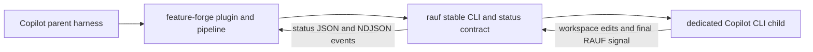

# Unified Copilot Adaptation Plan

Status: In progress, adversarial review incorporated
Created: 2026-08-23
Scope: `feature-forge` and sibling `../rauf`
Target: GitHub Copilot in VS Code, GitHub Copilot CLI, and Copilot Agent Host

## 1. Purpose

This is the single execution tracker for making feature-forge and rauf installable and fully
functional in the Copilot harness currently running this repository. It supersedes the ordering,
open-decision, and cross-repository tracking sections of these source plans without deleting their
detailed design evidence:

- `copilot-adapter-full-support.md`
- `rauf-copilot-cli-and-harness-remediation.md`

The source plans remain design references. When they disagree with this document about sequencing,
release gates, ownership, or completion, this document controls.

This plan does not treat generated files, documented paths, successful installation, and runtime
discovery as interchangeable proofs. Each has a separate gate.

### Implementation evidence: 2026-08-23

- Copilot CLI 1.0.78 confirms root `plugin.json`, `skills/<name>/SKILL.md`, and
  `agents/<name>.agent.md`; the earlier `com.github.copilot/agents/` assumption is rejected.
- feature-forge now generates a versioned Copilot plugin manifest, 13 native skills with preserved
  argument hints, and three native custom agents with strict tool aliases and subagent-only
  visibility. Generated output and minimal expected fixtures are synchronized.
- A cached local plugin install discovers all 13 skills. A structured prompt session discovers all
  three namespaced agents with zero warnings/errors and the expected capabilities: researcher and
  verifier have `read/search/execute`; spec writer additionally has `edit`.
- Copilot CLI 1.0.78 has a diagnostic limitation: `--plugin-dir` loads the custom agents but omits
  plugin skills from `skill list` and the runtime skill event. Cached `plugin install` discovers the
  skills. Packaged smoke tests must exercise the install lifecycle rather than treating
  `--plugin-dir` as sufficient skill proof.
- `tests/test_build_adapters.py` passes 117 tests in a disposable CI-like environment, and
  `bash scripts/validate.sh` passes. Direct installer migration and all rauf work remain open.

## Current Status

| Phase | Status | Completed evidence | Next bounded work |
| --- | --- | --- | --- |
| A. Contract Freeze | Complete | G0, G1, and G2 closed; host schema/root decision, exact child argv, prompt transport, JSONL, permissions, cancellation, environment filtering, and detached parent topology captured | Enter Phase B at `RAUF-101` |
| B. Rauf Runtime Provider | In progress | `RAUF-101`: canonical `AgentStreamEvent`; `RAUF-102`: buffered Copilot JSONL parser; `RAUF-103`: dedicated provider; `RAUF-104`: atomic registry replacement with stable provider values | Continue at `RAUF-105` |
| C. Rauf Native Operator Adapter | Not started | Official root `agents/` and `skills/` plugin layout confirmed | Enter only after G1; begin `RAUF-201` |
| D. Feature-Forge Native Adapter | In progress | Native manifest, 13 skills, three agents, fixtures, version gate, CLI discovery, and repository gate | Finish `FORGE-101`/`FORGE-102` residuals, then `FORGE-103` |
| E. Repository Verification and Documentation | Not started | Feature-forge changelog entry started; interim gate green | Wait for Phases B–D exits |
| F. Packaged Cross-Repository Verification | Not started | No harness artifact yet | Wait for G3; begin `INT-001` |
| G. Release and Pin Sequence | Not started | No release action taken | Wait for G5; begin owner-gated `REL-001` |

Gate status: **G0 closed; G1 closed by `COP-003` evidence and DEC-11; G2 closed by `COP-004` and
`COP-005`; G3 open, G4 open, G5 open, G6 open.** Phase B is active at `RAUF-105`. Runtime
prototyping completed during Phase D does not close later gates without its own required evidence.

## 2. Completion Claim

"Fully adapted to Copilot" means a clean user can complete all of the following without Claude
credentials, Claude model aliases, Claude-only instructions, or hand-copying generated files:

1. Install feature-forge and rauf using documented, released entry points.
2. Discover and invoke feature-forge skills in VS Code, Copilot CLI, and Agent Host.
3. Delegate to feature-forge custom agents with enforced tool boundaries.
4. Create and validate a feature backlog through feature-forge.
5. Start, monitor, pause, resume, and complete a rauf loop using `provider: "copilot"`.
6. Run a Copilot iteration child non-interactively with bounded authority, structured output,
   cancellation, actionable failures, and correct final RAUF signal handling.
7. Preserve user-owned instructions and customizations across install, update, migration, and
   uninstall.
8. Complete one integrated feature-forge-to-rauf item and one needs-human/resume scenario from each
   supported parent harness.

A manual instruction to "start rauf in another terminal" is not full adaptation. If the Agent Host
cannot directly nest Copilot, rauf must provide and test an external process boundary that the parent
harness can invoke and observe.

## 3. Fixed Decisions

These defaults were selected after the user requested an interview but was unavailable. On
2026-08-23, the implementation continuation directive accepted them as the bounded baseline after
cross-checking every open decision in both source plans. A later revision requires a dated decision
entry and must reopen any invalidated gate or task evidence.

| ID | Decision | Rationale |
| --- | --- | --- |
| DEC-01 | Agent Plugin is the preferred Copilot distribution; npm direct install remains a supported compatibility path. | Gives Copilot-native lifecycle management without abandoning existing installer users. |
| DEC-02 | Direct installs mirror native skills and agents while retaining one namespaced complete runtime bundle. | Native discovery files and shared feature-forge scripts have different layout needs. |
| DEC-03 | Remove the legacy managed instruction block only when manifest/sentinel ownership is proven and the region is unchanged. Preserve modified regions and report a conflict. | Update must not destroy user instructions. |
| DEC-04 | Copilot custom agents inherit the parent model initially. Rauf omits a model by default and supports `--no-model` for incompatible item aliases. | Copilot model availability is account-dependent. |
| DEC-05 | Copilot JSONL is mandatory for the supported rauf provider path. No unproven plain-text fallback. | Signal extraction must exclude metadata, tool arguments, and quoted control tokens. |
| DEC-06 | The Copilot iteration child uses the default coding agent, not a rauf supervisor custom agent. | Prevents recursive supervision and role confusion. |
| DEC-07 | Rauf remains the sole owner of backlog/state mutation and post-iteration commits. The child may edit and verify workspace files but may not commit or push. | Preserves the existing runner contract. |
| DEC-08 | Plugin and product versions are lockstep within each repository, while feature-forge and rauf remain independently versioned. | Avoids an unowned second release coordinate. |
| DEC-09 | Authenticated Copilot smokes are opt-in locally/release-time; sanitized fixtures and mock CLI tests are mandatory in CI. | Controls credential, privacy, cost, and flakiness risk. |
| DEC-10 | Unsupported native capability is release-blocking unless this plan names and tests an equivalent process boundary. | Prevents documentation from substituting for working behavior. |
| DEC-11 | On the tested VS Code 1.134.0/Copilot Chat 0.62.0 host, Copilot runtime assets must use package self-location plus explicit `FEATURE_FORGE_ROOT`; they must not depend on `PLUGIN_ROOT`. | Fresh-host legacy and Agent Plugins 1.0 hooks both left the token unexpanded and the environment variable unset. |

### 3.1 Supported Product and Runtime Matrix

Frozen 2026-08-23. "Minimum" is the lowest version this initiative may claim; "tested" is the
evidence available at freeze time and does not imply that an untested newer build is verified.

| Surface | Minimum supported | Tested at freeze | Policy and evidence |
| --- | --- | --- | --- |
| GitHub Copilot CLI | 1.0.78 | 1.0.78 | Required for native plugin diagnostics and JSONL contract work. `--plugin-dir` is not skill-discovery proof on this version. |
| VS Code | 1.134.0 | 1.134.0 stable, commit `110a328ea54b42367b803ec53ee0bf52ef26b419` | Initial Agent Plugins, skills, custom agents, and Agent Host baseline. |
| GitHub Copilot extension | 0.62.0 | Built-in `github.copilot-chat` 0.62.0, build 1 | Bundled with the tested VS Code build; no separately installed extension was reported by `code --list-extensions`. |
| Copilot Agent Host | VS Code 1.134.0 plus Copilot 0.62.0 | Current VS Code Agent Host session on that pair | Agent Host has no independent product version in this harness; evidence always records the VS Code and Copilot pair. |
| Node.js, feature-forge installer and rauf launcher | 18.0.0 | 24.19.0 locally; feature-forge CI uses 22 | Matches both published npm `engines` contracts. |
| Node.js, rauf source development | 22.0.0 | 24.19.0 locally; CI uses 22 | Matches the rauf workspace `engines` contract. |
| Python, feature-forge generator/runtime | 3.10 | 3.12.3 | Repository baseline is Python 3.10+; generated adapters retain that floor. |
| Bun, rauf source development | 1.3.10 | Repository-pinned 1.3.10; unavailable in this shell at freeze | The owning gate must run with `.bun-version`; absence locally is not runtime proof. |
| pnpm, rauf source development | 9.15.0 | 9.15.0 through Corepack | Matches the repository `packageManager` contract. |

Compatibility policy is **floor plus current**, not current plus previous minor. Sanitized fixtures
remain attributable to the minimum line, and release smokes run the then-current stable versions.
A newer patch or minor is provisionally eligible but is not called verified until the relevant G1,
G2, G4, or G5 diagnostics pass. A schema, argv, permission, discovery, or process-topology change
blocks release until the matrix and fixtures are updated. Versions below a stated floor are
unsupported; no text-output fallback is offered for older Copilot CLI versions.

Initial full Copilot runtime support is **Linux x64**, including the tested WSL2 kernel environment.
Feature-forge install/build CI also covers Ubuntu, macOS, and Windows, and rauf emits Linux arm64,
macOS x64/arm64, and Windows x64 binaries, but those facts are not Copilot runtime proof. Native
Windows, macOS, and Linux arm64 remain candidate platforms and cannot be promoted to full support
until their real permission, timeout, abort/process-tree, plugin discovery, and required parent-
harness smokes pass. Every runtime evidence record names OS, architecture, and whether Linux is WSL.

## 4. Ownership and Architecture

| Surface | Owner | Must not own |
| --- | --- | --- |
| Canonical feature pipeline, generated feature artifacts, Copilot skill/worker adapter, feature-forge installer migration | feature-forge | Provider execution or rauf commits |
| Backlog validation, provider selection, loop lifecycle, status/events, signal parsing, recovery, commit reconciliation | rauf | Feature planning stages or feature-forge installation |
| Current item implementation and verification | Copilot iteration child | Backlog/state mutation, commit, push, loop supervision |
| Loop invocation and status polling | Copilot parent using feature-forge/rauf supervisor surfaces | Direct item implementation while a child owns the item |

Each repository receives its own PR, verification gate, version, changelog, and owner-gated release.
No task requires one commit spanning both repositories.

## 5. Tracking Rules

- Task status is represented by its checkbox: `[ ]` open and `[x]` complete.
- Every task has one repository owner, explicit prerequisites, and evidence required to close it.
- `G0` through `G6` are hard gates. Downstream implementation may be prototyped, but no dependent
  task is complete until its gate is closed.
- Runtime statements require a dated probe with product version and platform. Documentation alone
  proves syntax/schema intent, not behavior.
- Generated output is changed only through canonical sources and generators.
- A gate may be waived only by adding a dated decision that narrows the supported claim and updates
  the completion claim, smoke matrix, docs, and release notes together.

## 6. Gate Summary

| Gate | Blocks | Exit evidence |
| --- | --- | --- |
| G0 Product contract | All implementation | DEC-01..10 accepted or revised; support matrix and version floors recorded |
| G1 Copilot host contract | Native adapter work | Validated plugin, skill, agent schemas; install roots; command names; tool aliases; discovery probes |
| G2 Copilot CLI child contract | Rauf provider work | Exact argv, prompt transport, JSONL fixtures, permissions, failures, cancellation, nested-process result |
| G3 Repository unit/integration gates | Cross-repo smoke | `pnpm gate` in rauf and `bash scripts/validate.sh` in feature-forge |
| G4 Packaged clean-install gate | Integrated claim | Packed/released artifacts install into clean fixture without repo-relative shortcuts |
| G5 Cross-repo harness gate | Release readiness | End-to-end success and needs-human/resume in CLI, VS Code, and Agent Host |
| G6 Release compatibility gate | Feature-forge pin/release | Compatible rauf release live, pin advanced, both release artifacts reverified |

### Bounded Phase Contracts

| Phase | Entry criteria | Work boundary | Exit criteria | Allowed successor |
| --- | --- | --- | --- | --- |
| A. Contract Freeze | Both repos and source plans readable; no product implementation prerequisite | Only decisions, support matrix, host/CLI probes, sanitized fixtures, permission policy, and process topology (`COP-001`–`COP-005`) | `COP-001`–`COP-005` each have dated evidence; G0, G1, and G2 are explicitly pass or blocker; no unresolved choice can change layout, authority, or topology | B after G2; C and D after G1 |
| B. Rauf Runtime Provider | G2 closed; rauf worktree reviewed; captured JSONL fixtures available | Dedicated provider, parser, registration, failure/signal/git behavior, tests, and provider-aware propagation (`RAUF-101`–`RAUF-108`) | All eight tasks complete; exactly one `copilot` descriptor; focused provider/runner tests and `pnpm gate` pass; generic preset removed without config migration | C or E after required dependencies |
| C. Rauf Native Operator Adapter | G1 closed; rauf provider contract stable for child/supervisor separation | Generated operator plugin, two agent boundaries, installed child instructions, drift/version/package gates (`RAUF-201`–`RAUF-204`) | All four tasks complete; four skills/two agents discovered; behavioral tool denials pass; generation is idempotent; `pnpm gate` passes | E |
| D. Feature-Forge Native Adapter | G1 closed for completion; existing generator/installer ownership reviewed | Native generation, runtime roots, direct placements, fresh installs, migration, and package gates (`FORGE-101`–`FORGE-107`) | All seven tasks complete; plugin and direct layouts resolve; migration is fail-safe/idempotent; focused tests, drift check, and `bash scripts/validate.sh` pass | E |
| E. Repository Verification and Documentation | B, C, and D exited | Product docs/changelogs plus clean repository/package preflights only (`RAUF-301`/`302`, `FORGE-201`/`202`) | All four tasks complete; docs describe only tested behavior; both clean gates and package-content checks pass; G3 closes | F |
| F. Packaged Cross-Repository Verification | G3 closed; exact candidate artifacts available; external fixture owner named | Out-of-tree lifecycle, discovery/capability, success, needs-human/resume, containment, and parent-harness matrix (`INT-001`–`INT-007`) | All seven tasks complete from exact artifacts; no user-content loss/path escape/secret leak; every required smoke cell passes; G4 and G5 close | G |
| G. Release and Pin Sequence | G5 closed; owner approves release actions | Rauf binary and launcher release, feature-forge pin, live re-smoke, feature-forge release (`REL-001`–`REL-004`) | Both live products verified in order; compatibility pair recorded; live install/success/resume checks pass; G6 closes | Initiative complete |

Do not absorb a failed exit criterion into the next phase. Record it as a blocker on the owning task
and remain in the current phase. Parallel work is permitted only when entry gates are independently
closed and files/verification surfaces do not conflict.

## 7. Work Breakdown

### Phase A: Contract Freeze

Status: Complete. `COP-001`–`COP-005` and G0/G1/G2 are closed; no provider code was changed in this
phase.

- [x] **COP-001 — Accept or revise fixed decisions**
  Repo: shared planning. Depends on: none.
  Evidence: dated entries in Section 3 and no unresolved decision that changes layout, migration,
  permission authority, process topology, or release order.
  Evidence (2026-08-23): accepted `DEC-01`–`DEC-10` after mapping feature-forge D1–D7 and rauf
  D1–D11 to the unified register; both source plans now record the same decisions and no decision
  affecting layout, authority, topology, migration, or release order remains open.

- [x] **COP-002 — Freeze supported product/version matrix**
  Repo: shared planning. Depends on: COP-001.
  Record minimum tested versions for Copilot CLI, VS Code, GitHub Copilot extension, Agent Host,
  Node, Python, and supported operating systems. Define whether "current plus previous minor" or a
  different compatibility policy applies.
  Evidence (2026-08-23): Section 3.1 records product/runtime floors, exact tested versions, the
  floor-plus-current revalidation policy, Linux x64/WSL2 as the initial supported runtime, and the
  evidence required before promoting macOS, native Windows, or Linux arm64.

- [x] **COP-003 — Capture official schemas and runtime diagnostics**
  Repo: feature-forge. Depends on: COP-001.
  Save dated evidence for Agent Plugins, `SKILL.md`, `.agent.md`, project/personal paths, command
  prefixes, `${PLUGIN_ROOT}`, tool aliases, agent visibility, and subagent invocation. Validate
  assumptions using the current harness, not repository prose that describes the legacy fallback.
  Progress (2026-08-23): `evidence/copilot-host-contract-2026-08-23.md` records official schemas;
  cached and direct project/personal discovery; all 13 plugin skills; prefixed/direct command names;
  all three agents and tool sets; researcher read, verifier edit denial, writer edit success; and a
  real parent `task`/subagent round trip. CLI 1.0.78 leaves `PLUGIN_ROOT` empty in ordinary worker
  shells and did not execute the disposable hook probe. The active VS Code/Agent Host predates the
  install. A later fresh Agent Host loaded all 13 skills and all three agents, invoked the installed
  guide, and delegated a read-only task to the researcher with the expected tool boundary. A hook
  added to the installed cache after host startup was not dynamically registered, so it could not
  test expansion. Remaining criterion: declare the hook/MCP probe before installation, then start a
  new VS Code/Agent Host process and prove `${PLUGIN_ROOT}` equals the installed root. That recovery
  ran from preinstalled disposable commit `d0c18ec2063bf32964c1718f2cf23a44f7bb2720` on VS Code
  1.134.0/Copilot Chat 0.62.0. VS Code registered the hook but invoked the literal token with no
  exported root; Bash failed on `/scripts/plugin-root-probe.sh`, and the output file was absent.
  The disposable resources were removed and the original registry verified. Remaining criterion:
  test the Agent Plugins 1.0 hook layout or record a dated scope decision replacing this dependency
  with self-location/explicit root behavior. The replacement package at disposable commit
  `1145ffb` declares the canonical Agent Plugins 1.0 schema, uses
  `com.github.copilot/hooks/hooks.json`, and has two independent SessionStart hooks. In the fully
  restarted host, the command-token script did not run and the absolute helper recorded
  `PLUGIN_ROOT=UNSET`; the hook log shows the token remained literal. DEC-11 therefore narrows the
  supported contract to package self-location plus explicit `FEATURE_FORGE_ROOT`. This closes
  `COP-003` and G1 without inferring a pass from CLI discovery.

- [x] **COP-004 — Capture real Copilot CLI child behavior**
  Repo: rauf. Depends on: COP-001.
  Record help/version and sanitized probes for auth, no-tools response, workspace edit, shell
  verification, needs-human, large prompt, model failure, permission failure, timeout, abort,
  SIGTERM/process-tree cleanup, malformed output, partial JSONL, and usage/credit failure where
  reproducible.
  Evidence (2026-08-23): `evidence/copilot-cli-child-contract-2026-08-23.md` records workspace edit,
  shell verification, needs-human, bounded prompt-file transport, invalid-model, isolated-auth,
  denied-write, timeout, AbortSignal, SIGTERM/process-tree cleanup, schema-grounded malformed and
  partial JSONL behavior, usage event shapes, environment filtering, and the final exact argv and
  permission profile. Direct large-prompt argv transport fails with `E2BIG`; stable credit/reset
  preflight is unavailable and is not used for `checkUsage`.

- [x] **COP-005 — Prove parent-to-child process topology**
  Repo: rauf. Depends on: COP-004.
  From Copilot CLI, VS Code, and Agent Host parents, prove direct nested launch or define a tested
  detached/service/terminal process boundary with machine-readable start and status behavior. Record
  inherited `COPILOT_*` handling without logging secrets.
  Evidence (2026-08-23): direct nested wrapper launch received an in-band shell permission denial.
  A workspace-local detached boundary returned machine-readable start and atomic status records,
  removed Copilot parent-session markers while preserving only explicit auth-location inputs, and
  launched an exit-0 1.0.78 child from both the current VS Code/Agent Host terminal surface and a
  Copilot CLI 1.0.78 parent. The supported topology is parent -> local rauf command -> detached
  runner -> filtered Copilot child, not direct recursion.

**Gate G0:** COP-001 and COP-002 complete.
**Gate G1:** COP-003 complete.
**Gate G2: Closed 2026-08-23.** COP-004 and COP-005 complete, including the selected permission
policy, bounded prompt transport, cancellation contract, environment filter, and detached topology.

### Phase B: Rauf Runtime Provider

Status: In progress. `RAUF-101` through `RAUF-103` are complete; exit requires `RAUF-104`–`RAUF-108` plus the rauf
gate.

- [x] **RAUF-101 — Neutralize shared stream types**
  Repo: rauf. Depends on: G2.
  Rename the internal `ClaudeStreamEvent` concept to a provider-neutral type, retaining an exported
  compatibility alias if required. Do not rename stable external loop event discriminators.
  Evidence (2026-08-23): `AgentStreamEvent` is canonical across the parser, provider options,
  Claude/Codex process paths, runner, tests, and package API documentation. The exported deprecated
  `ClaudeStreamEvent` alias preserves package compatibility; external `LoopEvent` discriminators
  are unchanged. `pnpm --filter @rauf/loop typecheck` passed, and 25 focused stream/Codex tests
  passed. The complete loop package then passed typecheck, lint, formatting, and all 408 tests.
  Milestone: rauf branch `feat/copilot-g2-contract`, signed commit `45603b1`.

- [x] **RAUF-102 — Implement Copilot JSONL parser**
  Repo: rauf. Depends on: RAUF-101, G2.
  Reconstruct assistant/final text only; emit tool/token events when reliable; preserve raw output;
  ignore unknown/malformed records; flush partial final lines; make callback failures non-fatal.
  Evidence (2026-08-23): `CopilotJsonlParser` buffers arbitrary stdout chunks, flushes an
  unterminated final record, preserves raw output, and reconstructs text exclusively from string
  `assistant.message.data.content`. A sanitized 1.0.78 fixture proves metadata, tool arguments and
  results, errors, unknown records, and malformed lines cannot enter reconstructed signal text.
  Captured tool lifecycle IDs/names produce paired events; usage records intentionally produce no
  token event because the frozen schema has no reliable input/output-token mapping. Callback
  exceptions are non-fatal. The focused Copilot/Codex/Claude parser suite passed 23 tests, followed
  by loop typecheck, lint, and changed-file formatting. Milestone: rauf commit `921971c`.

- [x] **RAUF-103 — Implement dedicated `CopilotCliProvider`**
  Repo: rauf. Depends on: RAUF-102, G2.
  Preserve provider id `copilot`; use the captured prompt transport and argv; forward cwd, env,
  model omission/selection, timeout, abort, and stream callbacks; disable prompts, remote control,
  export, and auto-update; enforce the approved filesystem/tool/git policy.
  Evidence (2026-08-23): `CopilotCliProvider` uses the exact 1.0.78 determinism, JSONL, named-tool,
  and git-denial argv; writes the full prompt to a mode-restricted package-owned temporary path
  under the workspace; passes only a bounded bootstrap in argv; and removes the prompt directory
  in `finally` after success, nonzero/timeout/cancellation results, and spawn failure. It filters
  inherited `COPILOT_*` session/authority variables while retaining the two approved auth-location
  inputs, forwards cwd/model/timeout/abort/stream callbacks through the shared detached process
  helper, invokes `CopilotJsonlParser`, and preserves raw stdout/stderr and process fields. The
  focused provider/parser/process suite passed 48 tests; loop typecheck, changed-file lint, and
  formatting passed. Registry and preset ownership remain unchanged for `RAUF-104`. Milestone:
  rauf commit `d63cdc4`.

- [x] **RAUF-104 — Replace the generic preset atomically**
  Repo: rauf. Depends on: RAUF-103.
  Register exactly one dedicated `copilot` descriptor in the same change that removes the generic
  preset. Prove registry uniqueness and preserve existing project/global/item provider values.
  Evidence (2026-08-23): `CopilotCliProvider` now self-registers under the unchanged `copilot` id,
  the generic preset and obsolete preset argv assertions were removed in the same milestone, and
  the default registry test proves exactly one Copilot descriptor whose factory constructs the
  dedicated provider. Selection tests prove item, project, and global `copilot` values remain
  unchanged. The focused registry/preset/selection suite passed 52 tests; all provider and
  selection tests passed 116 tests; loop typecheck, changed-file lint, and formatting passed.
  Milestone: rauf commit `a4f50e0`.

- [ ] **RAUF-105 — Classify Copilot failures without Claude semantics**
  Repo: rauf. Depends on: RAUF-103.
  Map auth, invalid model, permission, limit/credit, timeout, cancellation, infrastructure, malformed
  output, and missing signal to existing recoverable/fatal outcomes. Implement `checkUsage` only if
  a stable Copilot reset contract exists.

- [ ] **RAUF-106 — Prove signal and git ownership boundaries**
  Repo: rauf. Depends on: RAUF-102, RAUF-103.
  Test last-final-line signal behavior and ensure tokens in metadata, tool args, errors, or quoted
  prose cannot complete an item. Prove child commit/push denial and successful rauf-owned commit.

- [ ] **RAUF-107 — Add mock and fixture runtime matrix**
  Repo: rauf. Depends on: RAUF-104..106.
  Cover done, blocked, needs-human, no signal, malformed/unknown JSONL, non-zero exit, invalid model,
  auth, permission, timeout, abort, process cleanup, direct, detached, resume, and review paths.

- [ ] **RAUF-108 — Make install/config/UI provider-aware**
  Repo: rauf. Depends on: RAUF-104.
  Remove false Claude-only preflight; support `install/init --agent copilot`; preserve selection in
  reinstall, detached, resume, review, compiled CLI, and web paths; reject arbitrary argv injection;
  distinguish binary presence from authenticated readiness.

### Phase C: Rauf Native Operator Adapter

Status: Not started. Entry requires G1. Exit requires `RAUF-201`–`RAUF-204` plus runtime discovery
and behavioral tool-boundary proof.

- [ ] **RAUF-201 — Generate native Copilot operator bundle**
  Repo: rauf. Depends on: G1.
  Generate plugin manifest, four native skills, and two `.agent.md` files from canon with provenance,
  stale-file pruning, deterministic ordering, and a generated mapping/drop report.

- [ ] **RAUF-202 — Enforce operator agent boundaries**
  Repo: rauf. Depends on: RAUF-201.
  Make the backlog reviewer read/search/execute capable but non-editing. Make the loop driver able to
  invoke rauf and poll status but unable to become an iteration worker. Fail on unknown tool aliases.

- [ ] **RAUF-203 — Preserve installed child instructions**
  Repo: rauf. Depends on: RAUF-103.
  Keep the host-neutral sentinel block in `AGENTS.md`, Claude specialization in `CLAUDE.md`, and child
  ownership rules in `.rauf/RAUF.md`. Verify Copilot loads them and update/uninstall touches only
  rauf-owned content.

- [ ] **RAUF-204 — Add adapter drift/version/package gates**
  Repo: rauf. Depends on: RAUF-201.
  Wire generation checks into `pnpm gate`, keep plugin version lockstep with rauf, and verify intended
  Copilot artifacts in compiled binary/npm/repository-source distribution.

### Phase D: Feature-Forge Native Adapter

Status: In progress. Exit remains open until `FORGE-101`–`FORGE-107` all pass; the native generated
foundation alone does not satisfy installer, migration, root-resolution, or package criteria.

- [ ] **FORGE-101 — Emit native Copilot skills and plugin manifest**
  Repo: feature-forge. Depends on: G1.
  Emit `skills/<name>/SKILL.md`, preserve `argument-hint`, translate host terms and invocation prose,
  and generate a version-synchronized Agent Plugin manifest. Keep spec-pure canon unchanged unless a
  host-neutral correction benefits every adapter.
  Progress: native filenames, argument hints, root plugin manifest, version-sync, fixtures, and CLI
  cached-install discovery are implemented. Distribution-specific invocation prose remains open.

- [ ] **FORGE-102 — Emit native Copilot custom agents**
  Repo: feature-forge. Depends on: FORGE-101.
  Emit researcher, spec writer, and verifier `.agent.md` files with fail-loud tool mapping, inherited
  model, no nested worker delegation, tested visibility, and a real mechanism for the verifier's
  `forge-verify` dependency. Record unsupported model/turn/effort/memory fields accurately.
  Progress: native files, fail-loud tools, inherited model, `agents: []`, subagent-only visibility,
  explicit drop records, and CLI runtime loading are implemented. The verifier skill dependency and
  behavioral edit-denial/edit-success smokes remain open.

- [ ] **FORGE-103 — Resolve runtime assets in every layout**
  Repo: feature-forge. Depends on: FORGE-101.
  Extend `forge-root.sh` for self-location, `${PLUGIN_ROOT}`, `${FEATURE_FORGE_ROOT}`, project and
  personal runtime roots, and subdirectory execution. Test complete/degraded roots, spaces, shell
  metacharacters, and all existing adapter layouts.

- [ ] **FORGE-104 — Extend installer placement primitives**
  Repo: feature-forge. Depends on: G1.
  Support recursive native skill mirrors and agent mirrors with containment checks, dry-run parity,
  copy/symlink semantics, complete manifest ownership, and exact uninstall. Do not infer Copilot from
  a generic `.github` directory.

- [ ] **FORGE-105 — Implement fresh project and personal installs**
  Repo: feature-forge. Depends on: FORGE-102..104.
  Install native discovery files into captured current paths and one complete namespaced runtime
  bundle per scope. Mark confidence `verified-current` only after runtime discovery passes.

- [ ] **FORGE-106 — Implement fail-safe legacy migration**
  Repo: feature-forge. Depends on: FORGE-104.
  Apply new files first, verify results, remove only old manifest-owned orphans, remove an unchanged
  owned managed block, preserve modified content as `skip-modified`, write the new manifest last, and
  prove repeated update/uninstall idempotence. Never delete by filename alone.

- [ ] **FORGE-107 — Add generator/installer/version/package gates**
  Repo: feature-forge. Depends on: FORGE-101..106.
  Validate plugin/skill/agent schemas, names, tools, resource links, drop records, migration fixtures,
  generated drift, version sync, npm tarball contents, and clean source location.

### Phase E: Repository Verification and Documentation

Status: Not started. Entry requires Phases B, C, and D to exit. Exit requires all four repository
documentation/preflight tasks and G3.

- [ ] **RAUF-301 — Correct rauf documentation and release notes**
  Repo: rauf. Depends on: RAUF-107, RAUF-108, RAUF-204.
  Correct stale preset/provider/Claude-specific architecture prose; document supported versions,
  auth, permissions, model omission, child versus supervisor roles, plugin lifecycle, failures, and
  feature-forge invocation. Add `[Unreleased]` entry.

- [ ] **FORGE-201 — Correct feature-forge documentation and release notes**
  Repo: feature-forge. Depends on: FORGE-107.
  Replace legacy "no skills loader" guidance; document plugin-first and direct compatibility
  installs, command names, migration conflicts, diagnostics, supported versions, runtime roots, and
  uninstall. Add `[Unreleased]` entry.

- [ ] **RAUF-302 — Pass clean rauf gate and package preflight**
  Repo: rauf. Depends on: RAUF-301.
  Run `pnpm gate`, sandbox tests, compiled binary provider listing, mock loop, package/binary content
  inspection, and any repository release checks from a clean state.

- [ ] **FORGE-202 — Pass clean feature-forge gate and package preflight**
  Repo: feature-forge. Depends on: FORGE-201.
  Regenerate adapters, run `bash scripts/validate.sh`, run installer prepack and `npm pack --dry-run`,
  verify the Copilot bundle, remove generated `installer/adapters/`, and re-run the clean gate.

**Gate G3:** RAUF-302 and FORGE-202 complete.

### Phase F: Packaged and Cross-Repository Verification

Status: Not started. Entry requires G3 and exact candidate artifacts. Exit requires
`INT-001`–`INT-007`, G4, and G5.

- [ ] **INT-001 — Build a clean external fixture project**
  Repo: shared test artifact with one named owner. Depends on: G3.
  The fixture must live outside both source repos, start without feature-forge/rauf files, contain
  pre-existing user instructions/custom agents, and support repeatable project/personal/plugin tests.

- [ ] **INT-002 — Verify packaged installation lifecycle**
  Repo: shared. Depends on: INT-001.
  Install from the exact packed/release candidates, not source paths. Test plugin install/enable/
  disable/update/uninstall plus direct project/personal fresh install, legacy migration, conflict,
  repeated update, and uninstall. Confirm no user file loss and no orphan-owned file.

- [ ] **INT-003 — Verify native discovery and capability**
  Repo: shared. Depends on: INT-002.
  In Copilot CLI, VS Code, and Agent Host, list and invoke all feature-forge skills, invoke all three
  workers, prove writer edit authority, prove researcher/verifier edit denial, prove rauf operator
  skill discovery, prove backlog reviewer denial, and run loop-driver status polling.

**Gate G4:** INT-002 and INT-003 complete from packed artifacts.

- [ ] **INT-004 — Run integrated success scenario**
  Repo: shared. Depends on: G4, RAUF-107, RAUF-108.
  Create and validate a one-item backlog with installed feature-forge, start rauf with Copilot and no
  incompatible model override, poll only stable JSON status, let the child edit and verify, parse
  `RAUF_DONE`, and prove rauf alone updates state and commits.

- [ ] **INT-005 — Run integrated needs-human/resume scenario**
  Repo: shared. Depends on: INT-004.
  Prove no approval/ask-user hang, stable needs-human status, answer injection through the supported
  rauf contract, resume with the same provider/model policy, and eventual completion.

- [ ] **INT-006 — Run failure and containment scenario**
  Repo: shared. Depends on: INT-004.
  Exercise invalid model, missing auth, denied external path, denied commit/push, timeout/cancel,
  malformed stream, and child-process cleanup. Confirm actionable diagnostics, recoverable state, no
  false signal, no external file write, and no secret in logs/events/fixtures.

- [ ] **INT-007 — Execute parent harness matrix**
  Repo: shared. Depends on: INT-004..006.
  Repeat success and needs-human scenarios from Copilot CLI, VS Code, and Agent Host using direct
  nesting or the G2-approved external boundary. Record product versions, platform, auth mode,
  enabled flags, model policy, permission policy, duration, and artifact/log locations.

**Gate G5:** INT-004..007 pass. An unsupported required cell blocks the full-support claim.

### Phase G: Release and Pin Sequence

Status: Not started. Entry requires G5 and explicit owner approval for release actions. Exit
requires `REL-001`–`REL-004` and G6.

- [ ] **REL-001 — Release rauf through its owner-gated process**
  Repo: rauf. Depends on: G5.
  Merge via PR with green CI, prepare the repository-required version/tag/binary/npm artifacts, obtain
  owner approval, publish, and verify the live version and Copilot package contents. Do not publish
  merely because implementation merged.

- [ ] **REL-002 — Advance feature-forge's rauf pin**
  Repo: feature-forge. Depends on: REL-001.
  Update `RAUF_PIN`, schema install hint, installer docs/tests, `COMPATIBILITY.md`, generated adapters,
  feature-forge version, and changelog according to repository policy.

- [ ] **REL-003 — Re-run packed integration against live rauf**
  Repo: shared. Depends on: REL-002.
  Repeat G4 and the success/needs-human portions of G5 using the live rauf coordinate and the
  feature-forge release candidate.

- [ ] **REL-004 — Release feature-forge through its owner-gated process**
  Repo: feature-forge. Depends on: REL-003.
  Merge the pin/release PR with green CI, run package preflight and cleanup, obtain owner approval,
  dispatch the manual npm workflow, and verify version, dist-tag, adapter contents, and a clean install.

**Gate G6:** REL-001..004 complete and `COMPATIBILITY.md` names the verified pair.

## 8. Required Smoke Matrix

| Scenario | Copilot CLI | VS Code | Agent Host |
| --- | --- | --- | --- |
| Plugin install and native discovery | Required | Required | Required |
| Direct project install discovery | Required | Required | Required |
| Feature-forge skill manual invocation | Required | Required | Required |
| Feature-forge skill automatic discovery | Required | Required | Required |
| Researcher/verifier cannot edit | Required | Required | Required |
| Spec writer can edit | Required | Required | Required |
| Rauf loop driver and backlog reviewer boundaries | Required | Required | Required |
| Shared runtime root resolution | Required | Required | Required |
| Start detached Copilot-backed loop | Required | Required | Required |
| Status polling via stable JSON | Required | Required | Required |
| Integrated item completion and rauf-owned commit | Required | Required | Required |
| Needs-human, answer, and resume | Required | Required | Required |
| Uninstall preserves user content | Required | Required | Required |
| JSONL/tool/cancel/failure provider probes | Required | N/A | N/A |

"Required" means runtime proof, not only schema validation or generated-tree inspection.

## 9. Adversarial Review

### Blocking findings incorporated into the plan

| ID | Severity | Attack or failure | Why the source plans were insufficient | Resolution in this plan |
| --- | --- | --- | --- | --- |
| AR-01 | Critical | Native paths or Agent Plugin schema differ from plan assumptions, so installation succeeds but nothing is discovered. | Both plans cite evolving vendor surfaces before committing dated runtime proof. | G1 blocks emitter/installer completion; INT-003 proves all three harnesses. |
| AR-02 | Critical | A Copilot parent cannot launch another Copilot process, so feature-forge cannot actually drive rauf in the current Agent Host. | The rauf plan identifies the risk but permits an underspecified fallback. | COP-005 requires direct proof or a machine-observable external boundary; G5 exercises every parent. |
| AR-03 | Critical | Legacy migration deletes user-edited `.github/copilot-instructions.md` content or unrelated customizations. | Ownership intent was present, but transactional ordering and conflict completion were split across tasks. | DEC-03 and FORGE-106 require apply/verify/remove/write-last ordering and `skip-modified`. |
| AR-04 | Critical | Rauf places a large implementation prompt in argv, exposing data and hitting OS limits. | Prompt transport remained an open decision even though implementation phases followed it. | G2 cannot close without bounded prompt transport and a large-prompt probe. |
| AR-05 | High | JSON metadata or tool arguments contain `RAUF_DONE`, falsely completing an item. | Parser requirements existed, but integrated negative proof was not a release gate. | DEC-05, RAUF-102/106, and INT-006 require assistant-text-only reconstruction and adversarial fixtures. |
| AR-06 | High | Broad permissions let the child edit outside the repo, use remote/network functions, commit, or push. | `--allow-all-tools` replacement was not coupled tightly to containment evidence. | G2 freezes a named policy; RAUF-103/106 and INT-006 prove denial plus normal edit/verify success. |
| AR-07 | High | Plugin and direct installs produce different slash names, and generated workflow transitions invoke the wrong one. | The feature-forge plan offered three strategies without selecting one. | DEC-01/02 select plugin-first hybrid; G1 captures actual names; FORGE-101 and docs must be distribution-aware. |
| AR-08 | High | Rauf's dedicated provider collides with the generic preset or changes provider precedence. | Removal and registration were listed but not explicitly atomic. | RAUF-104 is one atomic task with uniqueness and compatibility evidence. |
| AR-09 | High | Claude-only item model aliases reach Copilot and fail account-dependently. | `--no-model` was recommended but not part of the end-to-end definition. | DEC-04, RAUF-103/108, and INT-004 require omission/default behavior. |
| AR-10 | High | Custom-agent tool aliases are accepted syntactically but do not enforce read-only/edit boundaries. | Schema validation and behavioral capability checks could be conflated. | G1 captures aliases; RAUF-202, FORGE-102, and INT-003 test denied and allowed actions. |
| AR-11 | High | Tests pass in source repos while npm/plugin artifacts omit adapters or rely on repo-relative paths. | Package preflight existed late and independently in each plan. | G4 requires clean external installation from exact packed candidates before integrated claims. |
| AR-12 | High | Feature-forge pins an unreleased/incompatible rauf build or releases before provider support is live. | Release ordering was narrative rather than a gated task chain. | REL-001..004 enforce live rauf, pin advance, re-smoke, then feature-forge release. |
| AR-13 | Medium | Direct installer auto-detects every repository containing `.github` and writes Copilot files unexpectedly. | Risk was noted but no explicit acceptance evidence owned it. | FORGE-104/105 require explicit targeting and conservative detection tests. |
| AR-14 | Medium | Unknown canonical tool tokens or dropped metadata silently weaken agents. | Drop reporting and fail-loud behavior were not consistently separated. | Unknown tool aliases fail generation; semantically unsupported fields require explicit drop records. |
| AR-15 | Medium | Operator custom agents leak into iteration-child context and cause recursive supervision. | Role distinction was documented but install topology could still mix them. | DEC-06/07, ownership table, RAUF-202/203, and INT-003 separate supervisor and child surfaces. |
| AR-16 | Medium | Authenticated CI leaks prompts/secrets, consumes credits, or flakes on account state. | Opt-in guidance existed but no fixed policy. | DEC-09 mandates fixture/mock CI and opt-in sanitized release smokes. |
| AR-17 | Medium | Runtime roots work only from repo root or fail in paths with spaces. | Resolver tasks did not force packaged out-of-tree execution before integration. | FORGE-103 plus G4 external fixture cover subdirectories, special paths, complete/degraded roots. |
| AR-18 | Medium | Documentation calls Copilot `verified-current` after file-layout tests but before runtime discovery. | Confidence transition lacked a precise gate. | FORGE-105 permits the label only after runtime discovery; G1/G4/G5 separate proof classes. |

### Residual risks that remain after execution

1. Copilot CLI and Agent Plugin contracts may change after the tested version. Mitigation is a
   declared version floor/range, fixture provenance, runtime diagnostics, and a documented failure
   outside the tested range rather than silent degradation.
2. Model and quota behavior varies by account. The supported baseline omits model selection and
   reports limits without pretending Copilot has Claude's reset semantics.
3. Platform-specific process-tree cancellation may differ. Every claimed OS requires a real abort
   smoke; an untested OS must not be listed as fully supported.
4. VS Code and CLI may discover the same plugin differently. The smoke matrix preserves separate
   cells and does not infer one from the other.

## 10. Final Definition of Done

The unified initiative is complete only when:

- [ ] G0 through G6 are closed with linked evidence.
- [ ] Every task in Phases A through G is complete or explicitly removed by a dated scope decision.
- [ ] Existing `provider: "copilot"` rauf configurations require no migration.
- [ ] Existing feature-forge Copilot installs migrate without user-content loss.
- [ ] All generated Copilot skills and agents are native, deterministic, provenance-marked, and
      protected by drift/version checks.
- [ ] Rauf uses one dedicated Copilot provider with bounded prompt, permission, output, failure,
      cancellation, model, signal, and git behavior.
- [ ] The required smoke matrix passes from packaged artifacts in all three parent harnesses.
- [ ] Clean repository gates pass after package-preflight cleanup.
- [ ] Rauf is released first, feature-forge pins that live version, integration is repeated, and
      feature-forge is released second.
- [ ] User documentation describes only tested install commands, invocation names, support limits,
      diagnostics, migration conflicts, and uninstall behavior.

## 11. Review Log

| Date | Review | Outcome |
| --- | --- | --- |
| 2026-08-23 | Initial cross-repository consolidation | Combined the two source plans into stable tasks, dependencies, hard gates, one smoke matrix, and an ordered release chain. |
| 2026-08-23 | Adversarial plan review | Added 18 failure scenarios; elevated host schema, nested execution, prompt transport, permission containment, packaged installation, and release compatibility to blocking gates. |
| 2026-08-23 | Implementation slice 1 | Added and runtime-verified feature-forge's native Copilot plugin foundation; corrected the plugin agent path and recorded the CLI 1.0.78 `--plugin-dir` skill-discovery limitation. |
| 2026-08-23 | Contract decision freeze | Accepted `DEC-01`–`DEC-10`, reconciled all source-plan open decisions, and closed `COP-001`; G0 remains open on the version/support matrix in `COP-002`. |
| 2026-08-23 | Support matrix freeze | Recorded Copilot/VS Code/extension/Agent Host and runtime floors, selected floor-plus-current compatibility, scoped initial runtime support to Linux x64/WSL2, closed `COP-002`, and closed G0. |
| 2026-08-23 | Host-contract probe | Passed CLI cached/direct discovery, command naming, agent capability, and subagent delegation cells. Kept `COP-003` and G1 open because the current VS Code/Agent Host predates installation and CLI did not prove `${PLUGIN_ROOT}`; recorded exact fresh-session recovery. |
| 2026-08-23 | Fresh-host recovery | Passed fresh VS Code/Agent Host discovery, installed guide loading, and read-only researcher delegation. A post-start disposable hook was not dynamically registered, so `${PLUGIN_ROOT}` remains unproven; G1 stays open and the next recovery must predeclare the hook/MCP before host startup. |
| 2026-08-23 | Operator restart handoff | Added `operator-actions.md` with the predeclared legacy Copilot `hooks.json` fixture, disposable install commands, full VS Code/Agent Host restart boundary, exact pass/fail output, continuation prompt, and next-session cleanup ownership. No downstream task was started. |
| 2026-08-23 | Root probe prepared | Replaced an escaped pasted script with literal validated Bash under `scripts/`, created the marketplace metadata, committed only the `/tmp` fixture as `d0c18ec`, installed plugin 0.18.0, byte-compared the cached hook/script, and cleared pre-restart output. Only the human-controlled full host restart remains. |
| 2026-08-23 | Predeclared root probe failed | Fresh VS Code 1.134.0/Copilot Chat 0.62.0 registered the legacy plugin SessionStart hook but neither expanded nor exported `${PLUGIN_ROOT}`; Bash attempted `/scripts/plugin-root-probe.sh`, no output file was created, disposable resources were removed, and COP-003/G1 remain open. COP-004 was not started. |
| 2026-08-23 | Agent Plugins 1.0 probe prepared | Rechecked the canonical schema and VS Code namespace contract, validated and installed disposable commit `1145ffb`, confirmed CLI discovery and byte-identical cached files, and cleared runtime output. A full VS Code/Agent Host restart is the remaining external boundary; COP-003/G1 remain open. |
| 2026-08-23 | RAUF-101 implementation | Replaced internal `ClaudeStreamEvent` usage with canonical `AgentStreamEvent`, retained a deprecated exported compatibility alias, left external loop events unchanged, and passed loop typecheck/lint/formatting plus all 408 loop tests. Committed as rauf `45603b1` on `feat/copilot-g2-contract`; Phase B continues at `RAUF-102`. |
| 2026-08-23 | RAUF-104 implementation | Atomically removed the generic Copilot preset and registered the dedicated provider under the stable `copilot` id. Uniqueness, dedicated construction, and item/project/global value compatibility passed 52 focused tests; the 116-test provider/selection suite, loop typecheck, lint, and formatting also passed. Committed as rauf `a4f50e0`; Phase B continues at `RAUF-105`. |
